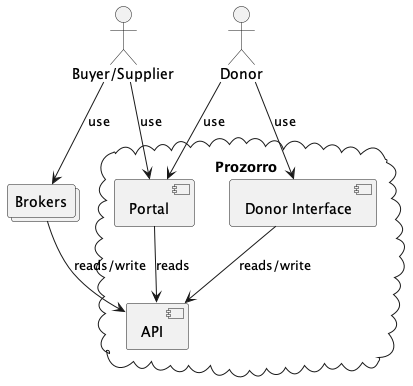
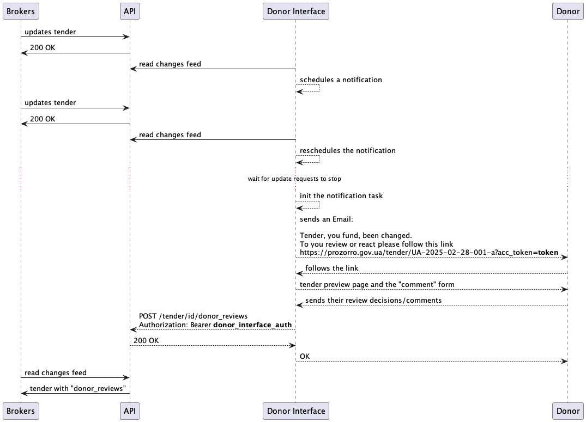

Кабінет Донора
--------------

У зв'язку з необхідністю додати деякі дії в системі від імені донора.
Є пропозиція додати окремий інтерфейс, який порівняно з реалізацією на майданчиках має наступні переваги:
- швидкість розробки
- відсутність дублювання роботи і повідомлень донорам
- зменшення навантаження на команди розробки
- можливість безболісно видалити функціонал



Функції інтерфейса донора:
- відображення тендера за посиланням (як на порталі)
- нотифікація імейлом донора про визначені події (публікація тендера, оголошення переможця)
- можливість залишити позитивним або негативним коментар до процедури, який вплаває на можливість успішно завершити процедуру.




Необхідні зміни:
- В апі додати структуру список ревью донора.
- Планувальник нотифікацій
- Інтерфейс відображення + форма відправки ревью
- Зі сторони майданчиків відслідковувати на появу ревью і показувати замовнику


Структура ревью
```json
POST /tenders/{uid}/donot_reviews
{
  "approved": false,
  "description": "Ніт"
}

201 Created
{
  "date": "2025-02-28T00:00:00",
  "tender_status": "active.awarded",
  "approved": false,
  "description": "Ніт"
}
```
tender_status та date фіксуются автоматично.


В концепті замовник не зможе підписати контракт 
без review з approved: true та tender_status:active.awarded
