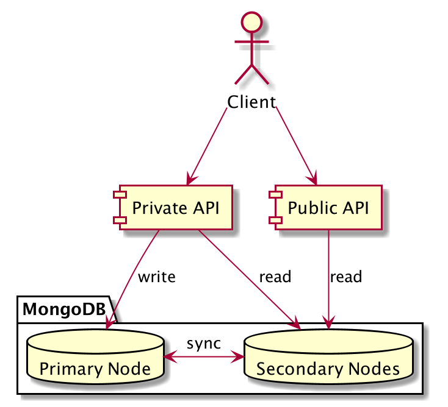
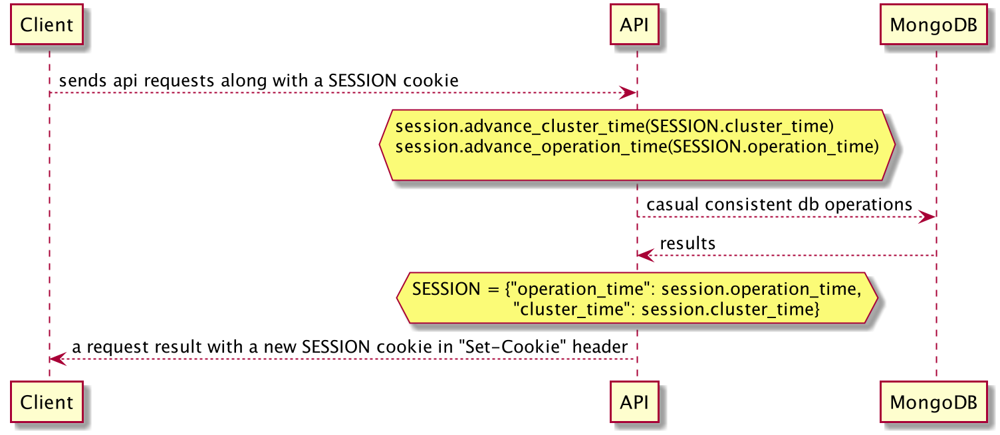

.. _cluster:

Робота з API в режимі кластеру
==============================

Дані синхронізуються на кластері з декількох серверів. Для узгодження між окремими запитами до ЦБД важливо, щоб клієнт працював завжди з одним сервером. Тому обов’язково використовувати реп’яшок (сookie) при подачі POST/PUT/PATCH/DELETE запитів. Реп’яшки (сookies) забезпечують прив’язку до сервера. Такий реп’яшок можна отримати через GET запит, а тоді використовувати його в POST/PUT/PATCH/DELETE.

Якщо під час операцій сервер запитаний реп’яшком недоступний або впав, клієнт отримає :ref:`412 код стану <errors>` запиту і новий реп’яшок. Запит потрібно повторити з використанням нового реп’яшка.

.. warning::
    Оскільки ми перейшли на кластер MongoDB з primary & secondary нодами, файл cookie SERVER_ID більше не потрібен.

    Прочитайте нові інструкції нижче

Сессії з “сausal consistency”
-----------------------------

В MongoDB клієнт застосунки, що використовують causal consistency, отримують наступні гарантії:
    * Read own writes
    * Monotonic reads
    * Monotonic writes
    * Writes follow reads

Оскільки наші клієнти працюють з базою даних через API, їм потрібно буде зберігати стан свого сеансу. Таким чином API може застосовувати параметри сессії та надавати гарантії кожному користувачеві.

  Рис. 1. Оглядова схема конфігурації підключення до бази даних

  Рис. 2. Діаграма послідовності механізма консистентного сеансу з базою даних

Приклад
~~~~~~~

Кожен запит повертає куку з даними сесії, які постійно оновлюються

.. sourcecode:: http

  POST /tenders/64e93250be76435397e8c992ed4214d1/bids HTTP/1.1

  Content-Type: application/json
  {
      "data": {
          ...
      }
  }

  HTTP/1.1 200 Created
  Content-Type: application/json
  Set-Cookie: SESSION=0KjQvtCxINGI0L4/IA==; Path=/
  {
      "data": {
          "id": "ddd45992f1c545b9b03302205962265b",
          "status": "draft",
          ...
      }
  }

Тож наступний запит має використовувати цю куку

.. sourcecode:: http

  POST /tenders/64e93250be76435397e8c992ed4214d1/bids HTTP/1.1

  Content-Type: application/json
  Cookie: SESSION=0KjQvtCxINGI0L4/IA==
  {
      "data": {
          ...
      }
  }

  HTTP/1.1 200 Created
  Content-Type: application/json
  Set-Cookie: SESSION=0JHQsNC90LTQtdGA0L7QvNC+0LHRltC70ZY=; Path=/
  {
      "data": {
          "status": "active",
      }
  }
