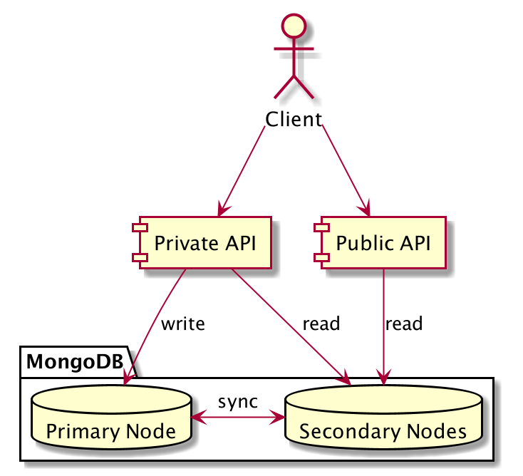
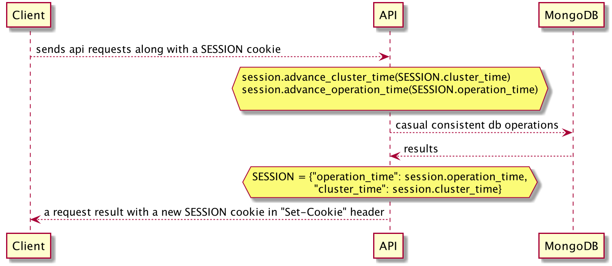

.. _cluster:

API in cluster mode
===================

There is a cluster of several servers that synchronize data between each other. Client should always work with the same server to ensure consistency between separate requests to the CDB. That is why cookie is required while sending POST/PUT/PATCH/DELETE requests. Cookies provide server stickiness. You can get such cookie via GET request and then use it for POST/PUT/PATCH/DELETE.

If during operations the server requested by cookie went down or is unavailable, client will receive :ref:`status code 412 <errors>` of request and new cookie to use. Request should be repeated with new cookie.

.. warning::
    Since we moved to MongoDB cluster with primary & secondaries,
    SERVER_ID cookie is no longer required.

    Please read the new instructions below

Causal consistency sessions
---------------------------

MongoDB clients with causal consistency sessions can achieve the following guarantees:
    * Read own writes
    * Monotonic reads
    * Monotonic writes
    * Writes follow reads

Since our clients work with database through API,
they will need to store their session state.
So that API is able to apply their parameters and provide the guaranties to every user.

  Fig. 1. Database connection configuration overview diagram

  Fig. 2. Consistent database session mechanism sequence diagram

Here is an example
~~~~~~~~~~~~~~~~~~

Every request returns a session cookie, that is continuously updated

.. sourcecode:: http

  POST /tenders/64e93250be76435397e8c992ed4214d1/bids HTTP/1.1
  Content-Type: application/json
  {
      "data": {
          ...
      }
  }

  HTTP/1.1 200 Created
  Content-Type: application/json
  Set-Cookie: SESSION=0KjQvtCxINGI0L4/IA==; Path=/
  {
      "data": {
          "id": "ddd45992f1c545b9b03302205962265b",
          "status": "draft",
          ...
      }
  }

Then the following request should use that cookies

.. sourcecode:: http

  POST /tenders/64e93250be76435397e8c992ed4214d1/bids HTTP/1.1
  Content-Type: application/json
  Cookie: SESSION=0KjQvtCxINGI0L4/IA==
  {
      "data": {
          ...
      }
  }

  HTTP/1.1 200 Created
  Content-Type: application/json
  Set-Cookie: SESSION=0JHQsNC90LTQtdGA0L7QvNC+0LHRltC70ZY=; Path=/
  {
      "data": {
          "status": "active",
      }
  }
