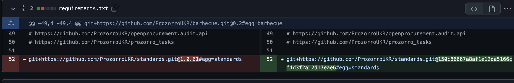
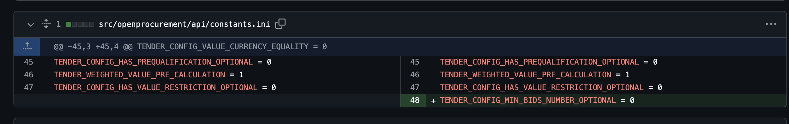
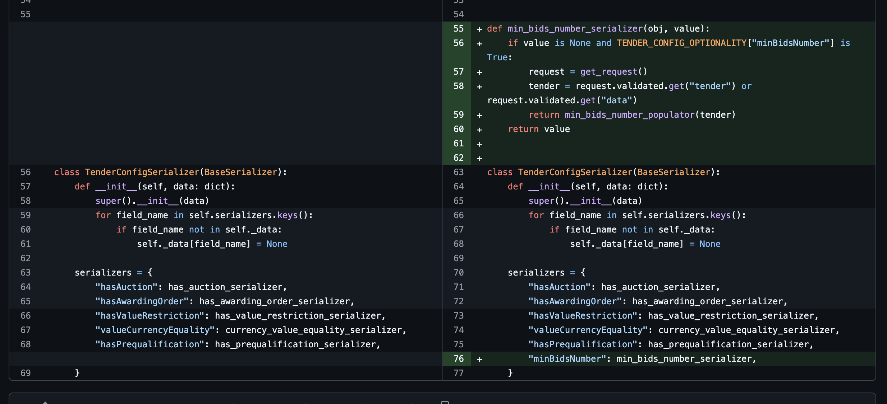
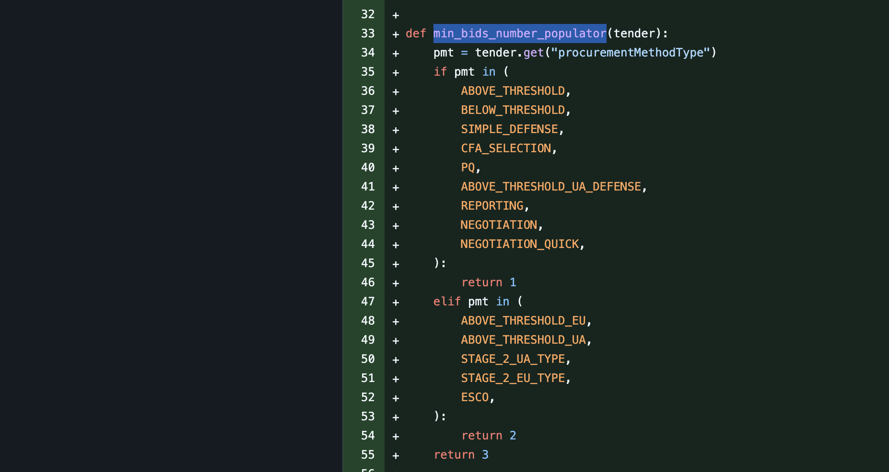
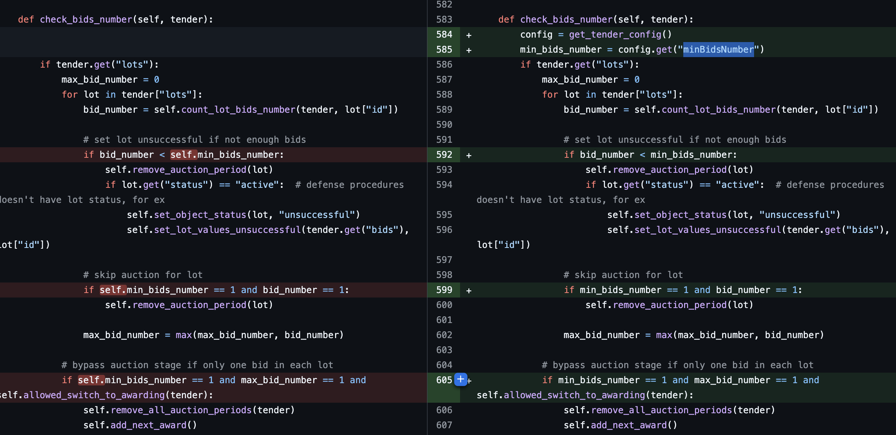

.. _cdb_configs:

Конфігурація процедур
=====================

.. _cdb_procedure_vs_configs:

Типи процедур / види закупівель  VS конфігурації закупівель
-----------------------------------------------------------

"Процедура" або тип закупівлі це логічно і законодавчо виокремлена сутність, яка реалізує процес закупівлі відповідно чітко визначених правил.
Втім, іноді правила можуть змінюватися або бути різними в межах однієї "процедури".
Такі відмінності можуть бути реалізовані допомогою кофігурацій.

Конфігурації, як інструмент, почали використовувати відносно недавно. Тому їх поки не дуже багато.
Раніше будь-яка відмінність поведінки процедури реалізовувалась через створення під це окремої "процедури".
Часто це робили копіюванням коду.

Зараз ми рухаємо систему в напрямку,
що буде інсувати єдина кодова база, а відмінності "процедур" повністю визначені "конфігами".

.. _cdb_procedure_configs:

Створення конфігурацій в репозиторії стандартів
-----------------------------------------------

Ознайомитись з усіма можливими конфігураціями процедур можна :ref:`тут <config>`.

Можливі значення конфігів для кожнох процедури мають бути вказані в `стандартах <https://github.com/ProzorroUKR/standards/tree/master/data_model/schema/TenderConfig>`_

При додаванні нового конфігу - його "назву" треба додати в файл кожної процедури.
А при додаванні нової процедури - додати новий файл, з вказанням усіх можливих варіантів конфігурацій.

Після додавання конфігурацій треба зробити можливим їх використання в коді як описано :ref:`тут <cdb_standards>`

Ось `коміт приклад <https://github.com/ProzorroUKR/standards/commit/5cf25953b542253eb5f74578d1fbc154947e1455>`_
створення нової конфігурації: внесення назви конфігу у відповідний словник і внесенння можливих значень в файл кожнох процедури.

*Для розробки можна використовувати власну версію стандартів: вказувати в requirements.txt посилання на свій форк репозиторія стандартів або підкидати стандарти к контенер апі черeз volumes*

Реалізація конфігурацій в код АПІ
---------------------------------

Реалізація складається з багатьох кроків, всі вони як правило обов'яхкові.

Розглянемо `цей коміт <https://github.com/ProzorroUKR/openprocurement.api/commit/5d6cb6cd27b4f47df4ded49108e47627b8af7b50>`_ як приклад.

Вказано на використання версії стандартів, що мають необхідний конфіг.
(Це окремий коміт, якого ще не має у main гілці)
Додавання конфігу до репозиторія стандартів було попереднім кроком.

Режим сумісності / перехідний період
~~~~~~~~~~~~~~~~~~~~~~~~~~~~~~~~~~~~

Щоб не зламати сервіси клієнти АПІ,
необхідно реалізувати можливість автоматичного заповненя конфігу.
Після релізу змін, АПІ має приймати конфіг в межах дозволених значень завжди.
Але додатково заповнювати значенням по замовчанню, допоки усі клієнти не зроблять відповідні змінні
і "перехідний період" буде вимкнено.

Розглянемо приклад в коді.
(Іноді така конфігураціє буває датою)

В цьому конкретному випадку,
така конфігурація (коли включена) дозволяє НЕ передавати в апі нову конфіг `minBidsNumber`.
І той буде заповнюватись автоматично значенням 1, 2 або 3 відповідно до поередньої поведінки процедур.

Конфіг перехідного періоду велючає заповнення інофрмації
про конфіг кожного тендера, якщо його ще немає.
Цей серіалізатор буде заповнювати значення `minBidsNumber`,
якщо його немає в БД і воно не було передано в запиті.

Міграція
~~~~~~~~
Для уніфікації конфіг має бути присутнім в усіх об'єктах,
тому необхідно додати приальне значенно в "дорелізні" об'єкти.
Переглянути код можна
`тут <https://github.com/ProzorroUKR/openprocurement.api/blob/5d6cb6cd27b4f47df4ded49108e47627b8af7b50/src/openprocurement/tender/core/migrations/add_config_min_bids_number.py>`_

Зверніть увагу, функція що повертая значення по замовчанню на перехідний період та сама,
що і в міграції.

Використання конфігу
~~~~~~~~~~~~~~~~~~~~

Далі передане (або за замовчанням) значення використовується в коді логіки процедури.

*Конфіг в прикладі був раніше атрибутом стейт класа і перевизначався наслідуанням*

Тести
~~~~~

Вся поведніка має бути покрита тестами.

