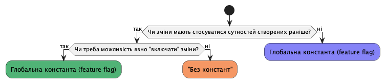

Константи
=========

Використання констант є майже завжди обов'язковим при введенні нової функціональності в АПІ ЦБД.

Правило вибору визначаються бізнесовими потребами, виходячи з яких ми маємо декілька відповідних технічних рішень. Відповідний сценарій можна підібрати відповідно до очікуваної поведінки описаної нижче.

Спрощено він може виглядати так:

Далі розглянемо можливі сценарії і методи їх вирішення за допомогою констант.

"Без констант"
~~~~~~~~~~~~~~

**Усі зміни та нові функції починають працювати одразу після релізу для всіх наявних в системі об'єктів**:

- нова функціональність замінює стару
- нова функціональність вмикається релізом

Повернути попердню версію буде скоріш за все неможливо (наприклад, через інші зміни в релізі). Тому так релізимо восновному фікси помилок і незначні зміни (що не потребують доробки майданчиків).

Розробники реалізують цю поведінку просто замінюючи старий код новим, без розділення логіки на "до" та "після".

Якщо реліз внесе зміни в структуру даних, то для вже сторених в системі сутностей їх можна буде зробити за допомогою :ref:`міграцій <developers_migrations>`.

.. CAUTION::
    Міграція структур займає деякий час. Створені **до релізу** сутності можуть некоректно відпрацьовувати до її завершення.

Глобальна константа (feature flag)
~~~~~~~~~~~~~~~~~~~~~~~~~~~~~~~~~~

**Зміни та нові функії можна включити/виключити або включити автоматично у вказаний час у майбутньому.**

Може використовуватись звичайний флаг - зміни можна включати виключати.

Або це буде якась дата у майбутньому, тоді стара поведінка продовжить працювати після релізу до настання дати, а потім почне працювати нова. Поки час "спрацювання" не настав, його можна переносити. Після - залежить від змін.

**Розробники** для реалізації такого сценарію залишають і нову і стару версії коду. Функціональність визначається порівнянням дати в константі з поточною датою. Після настання дати можна видаляти з коду попередню (вже непрацюючу гілку логіки).

Якщо нова функціональність внесе зміни в структуру даних, то для вже сторених в системі сутностей їх можна буде зробити за допомогою :ref:`міграцій <developers_migrations>`.

У даному сценарії, можна передбачити можливість мігрувати структури і дані до "увімкнення" константи. Таким чином не мати проблем з некоректними старими об'єктами, як у варіанті "без констант".

`Приклад реалізації bool флага <https://github.com/ProzorroUKR/openprocurement.api/commit/3b1158aa2e7997c2aedd3b771835919a8ca6b32b>`_

Конфіг по даті створення об'єкта
~~~~~~~~~~~~~~~~~~~~~~~~~~~~~~~~

**Зміни та нові функії починають діяти для сутностей створених після вказаного часу у майбутньому**

У випадку "глобальної константи" поведінка системи ділиться на ДО і ПІСЛЯ визначенох дати. Наприклад, вчора я міг ввести номер телефону, що починається з +7 , а сьогодні не можу.

А якщо використовувати "конфіг по даті створення", то усі об'єкти в системі діляться на ДО і ПІСЛЯ. Наприклад,  я створив вчора тендер і в ньому можна вказувати номери телефону на +7 (і можна буде вказувати завжди). А в тому, що створено сьогодні - вже неможна.

Часто такий сценарій краще підходить для змін до процедур визначених законом. Також з цим підходом не буде сюрпризів що валідація "перестала проходити" для тих самих даних наступного дня. Бо це іноді трапляється в системі навіть тоді, коли дані вже навіть не змінюються.

**Розробники** реалізують такий сценарій аналогічно до "глобальної константи", але дату константи порівнюють з датою створення об'єкту (а не з поточною датою).

`Приклад реалізації <https://github.com/ProzorroUKR/openprocurement.api/commit/29b6dc1269df870a4803366b6f70d340999244c4>`_
