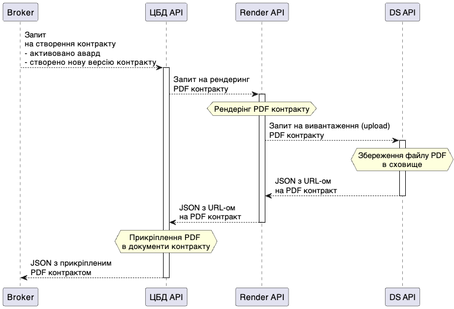

Взаємодія між ЦБД та сервісом Render API
----------------------------------------

Електронний контрактінг
=======================

Під час створення електронного контракту, ЦБД викликає Render API для генерації PDF-документу договору.

Схема взаємодії:

   
.. raw:: html
    
     
