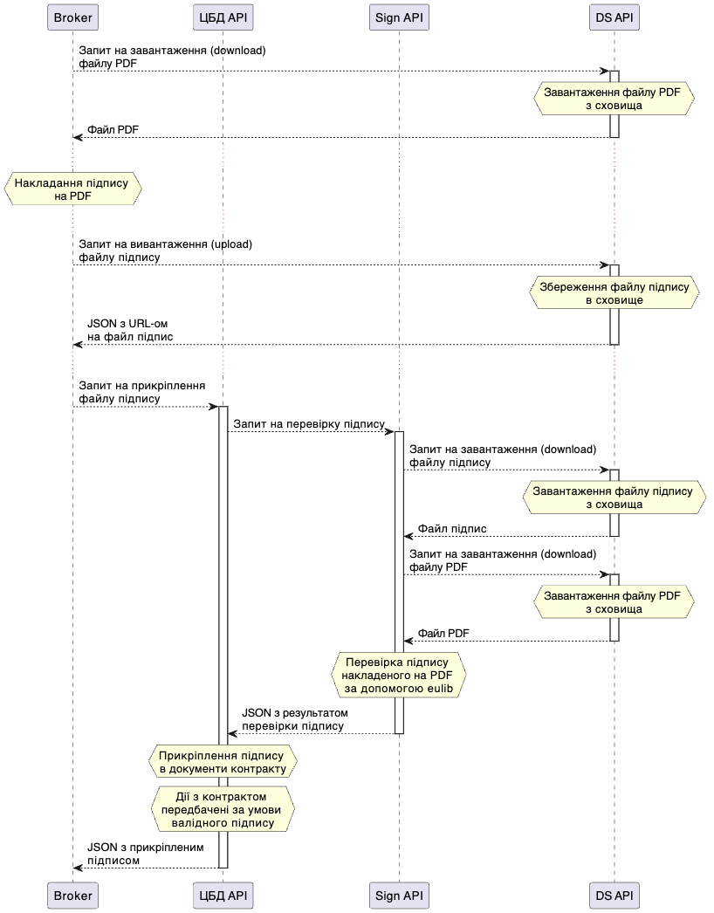

Взаємодія між ЦБД та сервісом Sign API
======================================

Електронний контрактінг
-----------------------

Під час підпису електронного контракту, ЦБД викликає Sign API для перевірки підпису контракту.

Схема взаємодії:

   
.. raw:: html

     
