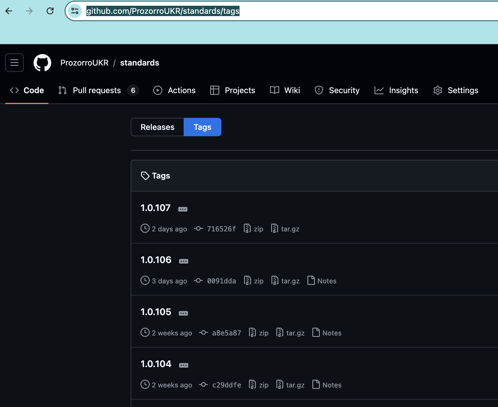
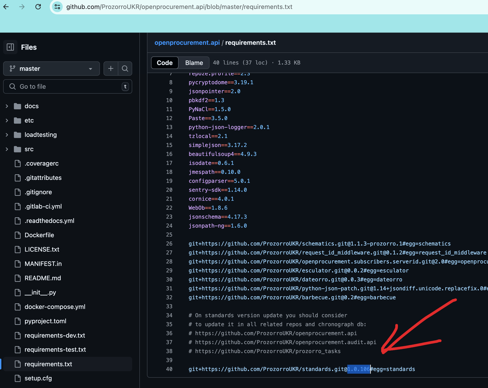
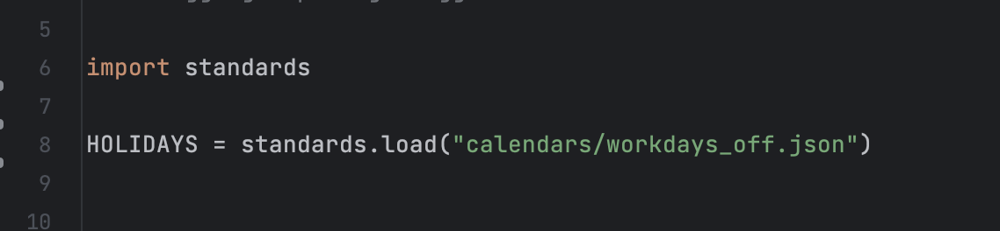

.. _cdb_standards:

Словники і стандарти
====================

Деякі поля апі мають валідацію на відповідність словнику. Словники зберігаються в `окремому репозиторії <https://github.com/ProzorroUKR/standards>`_.

Зміни до словників вносяться пул реквестами, після чього створюється `нова версія (тег) <https://github.com/ProzorroUKR/standards/tags>`_.

Для того щоб апі використовувало нову версію словників - вона вказується в `requirements.txt <https://github.com/ProzorroUKR/openprocurement.api/blob/master/requirements.txt>`_:

**Важливо повідомити клієнтів АПІ про перехід на нову в версію словників!**

Далі в коді досить легко імпортувати і використовувати будь який потрібний словник. Наприклад ось код для `словника вихідних днів <https://github.com/ProzorroUKR/standards/blob/master/calendars/workdays_off.json>`_.

Тож для використання нових словників/стандртів ми:

 - створюєм пул реквест зі змінами
 - отримуємо апруви і мержим
 - створюєм новий тег-версію
 - вказуємо цю версію в requirements.txt
 - реалізуємо зміни в коді
