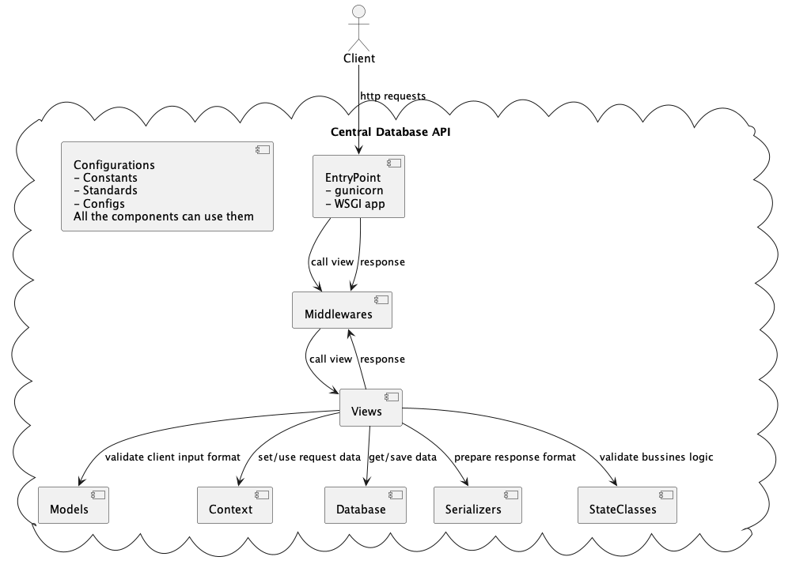

.. _cdb_structure:

Основні компоненти коду
=======================

Даний документ описує розділеня відповідальності компонент, але не виключає наявних невідповідностей у існуючому коді (ТехБорг)

.. toctree::
   :maxdepth: 2

   plugins
   middleware
   views
   models
   state
   database
   context
   serializers
   migrations