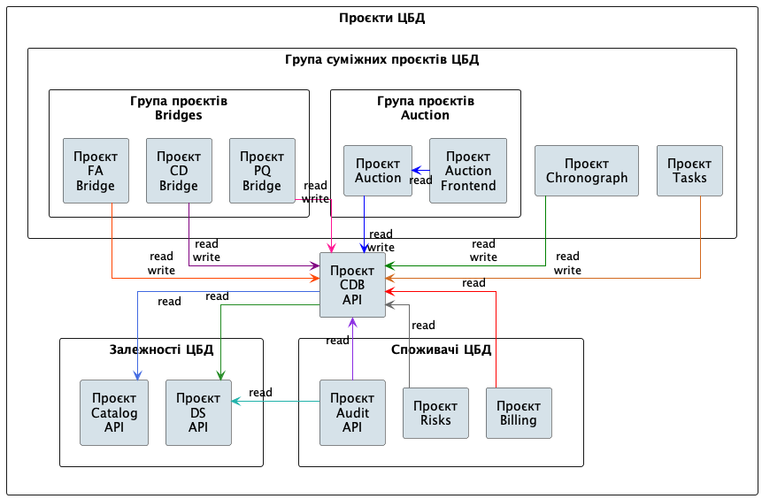
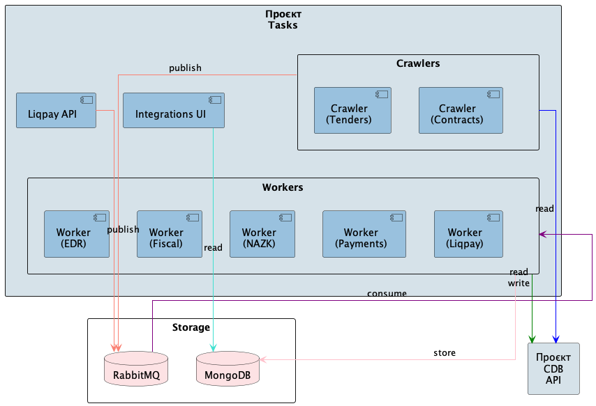
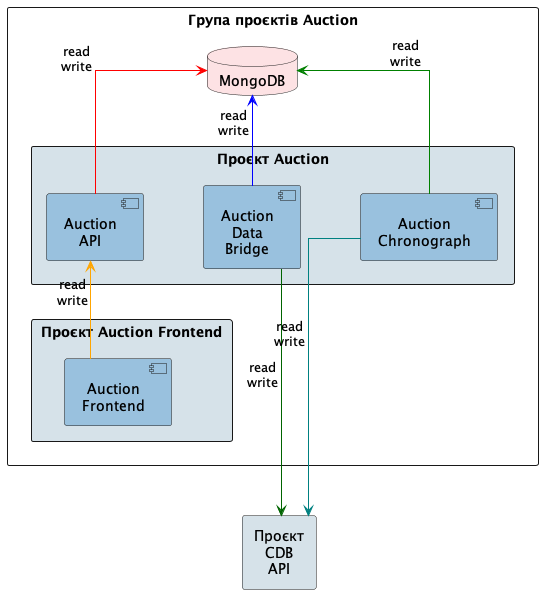

.. _developers_system:

.. |github| image:: img/github-mark.png
   :width: 20px
   :height: 20px
   :alt: GitHub

Проєкти ЦБД
===========

Проєкт ЦБД
----------

|github| `ProzorroUKR/openprocurement.api <https://github.com/ProzorroUKR/openprocurement.api>`_

.. admonition:: TODO

   Загальний опис

**Документація:**

.. toctree::
   :maxdepth: 3

   cdb/code
   cdb/schema
   cdb/structure/index
   cdb/init
   cdb/accr
   cdb/auth
   cdb/configs
   cdb/constants
   cdb/standards
   cdb/dates
   cdb/documents
   cdb/chronograph
   cdb/errors
   cdb/masking
   cdb/logging
   cdb/documentation
   cdb/tests
   cdb/ci
   cdb/release
   cdb/render
   cdb/sign

Група суміжних проєктів ЦБД
---------------------------

.. admonition:: TODO

   Загальний опис

Проєкт chronograph
~~~~~~~~~~~~~~~~~~

|github| `ProzorroUKR/prozorro_chronograph <https://github.com/ProzorroUKR/prozorro_chronograph>`_

.. admonition:: TODO

   Загальний опис

Проєкт tasks
~~~~~~~~~~~~

|github| `ProzorroUKR/prozorro_tasks <https://github.com/ProzorroUKR/prozorro_tasks>`_

.. admonition:: TODO

   Загальний опис

.. toctree::
   :maxdepth: 2

   tasks/crawlers/index
   tasks/workers/index
   tasks/liqpay_api
   tasks/integrations_ui

Група проєктів Auction
----------------------

Проєкт Auction
~~~~~~~~~~~~~~

|github| `ProzorroUKR/prozorro-auction <https://github.com/ProzorroUKR/prozorro-auction>`_

.. admonition:: TODO

   Загальний опис

.. toctree::
   :maxdepth: 2

   auction/chronograph
   auction/databridge
   auction/api

Проєкт Auction Frontend
~~~~~~~~~~~~~~~~~~~~~~~

|github| `ProzorroUKR/prozorro-auction-frontend <https://github.com/ProzorroUKR/prozorro-auction-frontend>`_

.. admonition:: TODO

   Загальний опис

.. toctree::
   :maxdepth: 2

   auction/frontend

Проєкт Catalog API (Prozorro Market)
------------------------------------

|github| `ProzorroUKR/prozorro-catalog <https://github.com/ProzorroUKR/prozorro-catalog>`_

.. admonition:: TODO

   Загальний опис

Проєкт Audit API
----------------

|github| `ProzorroUKR/openprocurement.audit.api <https://github.com/ProzorroUKR/openprocurement.audit.api>`_

.. admonition:: TODO

   Загальний опис

Проєкт DS
---------

|github| `ProzorroUKR/openprocurement.documentservice <https://github.com/ProzorroUKR/openprocurement.documentservice>`_

.. admonition:: TODO

   Загальний опис

Проєкт risks
------------

|github| `ProzorroUKR/prozorro-risks <https://github.com/ProzorroUKR/prozorro-risks>`_

.. admonition:: TODO

   Загальний опис

Проєкт Render API
-----------------

.. admonition:: TODO
   
   Загальний опис

.. toctree::
   :maxdepth: 2

   cdb/render

Проєкт Sign API
---------------

.. admonition:: TODO

   Загальний опис

.. toctree::
   :maxdepth: 2

   cdb/sign

Бібліотеки
----------

Бібліотека Crawler
~~~~~~~~~~~~~~~~~~

|github| `ProzorroUKR/prozorro_crawler <https://github.com/ProzorroUKR/prozorro_crawler>`_

.. admonition:: TODO

   Загальний опис
