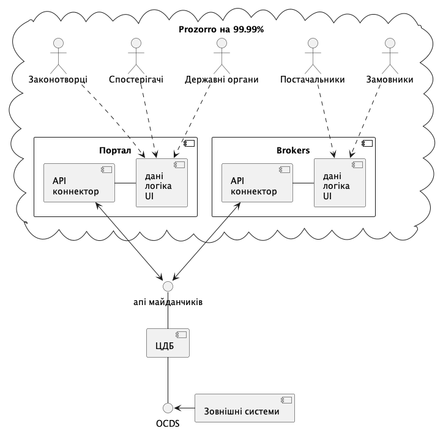
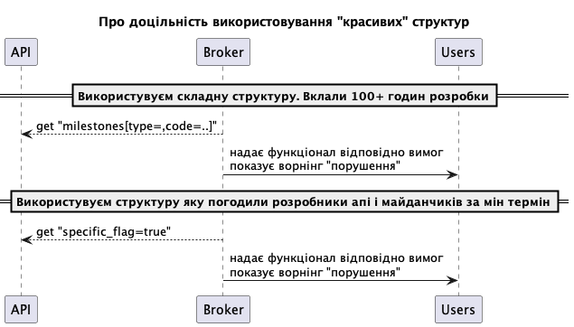

.. _developers_schema:

Структура даних запитів/відповідей АПІ
======================================

Користувачі АПІ
---------------

В екосистемі Прозорро основними користувачами апі є майданчики і портал,
а також внутрішні сервіси ЦБД (як сервіс інтеграцій).

Через відкритість сервісу теоретично будь хто може читати дані,
але це робить їх коистувачами, бо ніхто в їх інтересах не буде робити розробку/доробку.

Принцип проектування структури даних АПІ
----------------------------------------

Повний перелік крітеріїв, які беруться до уваги, при виборі структури даних:

- зручність роботи з нею розробників АПІ, майданчиків та порталу

В минулому команда багато часу витратили на розробку саме структур даних і це було помилкою,
бо насправді майданчики реалізуть необхідну поведінку системи.

Будь-які дебати щодо красивих чи логічної структури є тратою часу в найкращому випадку,
а в гіршому ще й внесемо в систему :ref:`щось незручне<criteria_operation>`.
