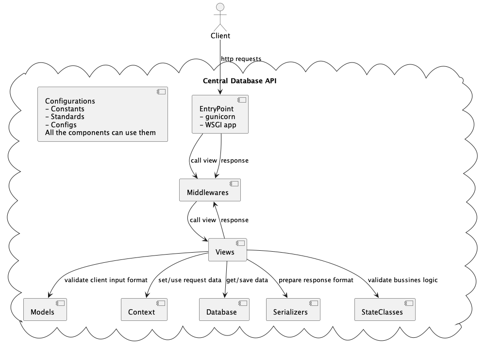

.. _developers_structure:

Основні компоненти коду
=======================

Даний документ описує розділеня відповідальності компонент,
але не виключає наявних невідповідностей у існуючому коді (ТехБорг)

Middlewares
-----------
Код який виконуєтся для кожного запиту до сервіса на початку і наприкінці обробки запита,
тобто до view і після.

Що робить middleware:

- Загальні речі які робить кожен запит вашого застосунку (зберігає в контекст якісь куки, шось логує, шось рахує)

Що НЕ робить middleware:

- Ніякої бізнес логіки або чогось специфічого тільки для частини views

Views
-----

Клас з методами або функції,
що викликає WSGI application для обробки http запита клієнта.

Що робить view:

- Працює з БД
- Перевіряє авторизацію (Authorization header)
- Перевіряє формат переданих даних (Models)
- Викликає код бізнес логіки  (State Classes)
- Викликає серіалізатор для формату відповіді (Serializes)

Що НЕ робить view:

- Не реалізує жодної бізнес логіки (Однакові для всіх типів процедур)

Views є таким собі ключовим хабом, який збирає до купи різні компоненти системи.
Розбиратись з якимось фукнціоналом буде краще починаючи з них.

Приклад:

.. sourcecode:: python

    class ObjectResource(BaseResource):
        serializer_class = ObjectSerializer

        @json_view(
            permission="patch_permission",
        )
        def patch(self, uid):
            with database.get_and_update(pk=uid) as obj:
                data = self.model_class(self.request.data).validate()
                self.state_class.on_patch(obj, data)
            logger.info("Object has been updated", extra={"OBJ_ID": uid})
            return {
                "data": self.serializer_class(obj).data,
            }

Database
--------

Код компонент Database інкапсулює роботу з базами даних таким чином,
що при переході, скажемо, з MongoDB на PostgreSQL необхідно лише міняти код цих компонент.

Приклад:

.. sourcecode:: python

    with database.get_and_update(pk=uid) as obj:
        ...

Database НЕ імплементує бізнес логіки! (Для цього є StateClasses)

Виклики компоненти Database відбуваются тільки з Views!

Serializers, StateClasses не мають робити запити до БД, зробить їх заздалегіть і покладіть в конекст запиту (він для цього існує).

Таким чином робимо більш наглядною роботу з БД, що буже важливо.
Наприклад, коли ми працюємо читаємо і пишемо декілька об'єктів в БД треба контролювати атомарність/конкурентність всіх або частини операцій,
що просто неможливо коли запити розкидані по всьому коду.

Models
------
Код який валідує структуру та формат переданих даних.

Приклад:

.. sourcecode:: python

    class ChildObject(BaseModel):
        title = StringType(required=True)
        description = StringType()

    class Object(BaseModel):
        id = MD5Type(required=True)
        child = ModelType(ChildObject, required=True)

Треба бути уважним, бо деякі перевірки даних насправді краще робити в StateClasses.

Приклади, що описує/валідує Models

- Структуру даних
- Формат, тип полів
- Обов'яковість полів, якщо вона не залежить від бізнес процесів

Приклади, що  НЕ описує/валідує Models

- Зміна даних в об'єкті з одних на інші

Context
-------
Дані які зберігаются в межах одного запиту,
реалізований на `threading.local()` або аналогах.

Приклади таких даних:

- Бізнесовий час запиту `get_now()`
- Значення `X-Request-ID`
- `get_request()`
- Сесія роботи з БД `get_db_session()`

Важливо:
Об'єкти контекст запиту `get_tender()`, `get_bid()`, etc
що посилаются на відповідний ключ в `request.validated`,
використовуются лише в межах рефакторінгу (для зручності).

В наступних версіях стейт класи та функції проботи з БД мають працювати ЯВНО з цими об'єктами!

Serializers
-----------
Класси або функції, які приймають структуру з БД
і повертають форматований/фільтрований об'єкт-відповідь,
який безпосередньо конвертуєтся до json-строки і надсилаєтся в тілі http відповіді.

Серіалізатори також приховують та маскують дані, що визначаєтся бізнес правилами.
Таким чином серіалізатори реалізують бізнес логіку, що не дуже добре.
Краще мати різні серіалізатори, які керуются кодом, що визначає бізнес логіку.

Приклад:

.. sourcecode:: python

    class ChildObjectSerializer(BaseSerializer):
        serializers = {
            "description": lambda x: x if x else "No description",
        }

    class ObjectSerializer(BaseSerializer):
        serializers = {
            "child": ChildObjectSerializer,
        }

.. _developers_structure_state_classes:

StateClasses
------------
Класи що визначають бізнес логіку проведеня тендерів/планів/контрактів  etc,
фактично реалізуючи BPMN та sequence діаграми надані БА.
StateClasses можуть управляти/визначати модель даних, необхідний для кожної дії,
та серіалізатор відповіді (напр. повний або неповний)

Приклад:

.. sourcecode:: python

    class ObjectState(BaseState):
        should_do_something: bool = False
        something_to_return: int = 42

        def on_patch(self, before, after):
            self.do_something()

        def do_something(self):
            if self.should_do_something:
                # do something
                return self.something_to_return

При реалізації похідних стейт класів, наприклад для різних типів тендерів, класи що наслідуються не мають містити реалізації бізнес логіки а мають конфігурувати `core` класи (у випадках коли спеціфічна функціональність не реалізована за допомогою конфігурації об'єкта)

Приклад:

.. sourcecode:: python

    class BelowThresholdObjectState(ObjectState):
        should_do_something: bool = True

    class RequestForProposalObjectState(ObjectState):
        should_do_something: bool = True
        something_to_return: int = 10
