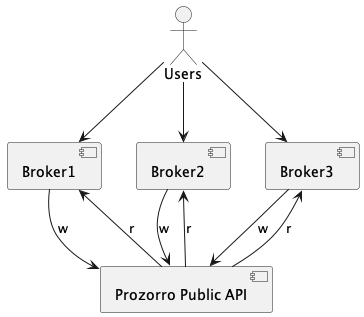
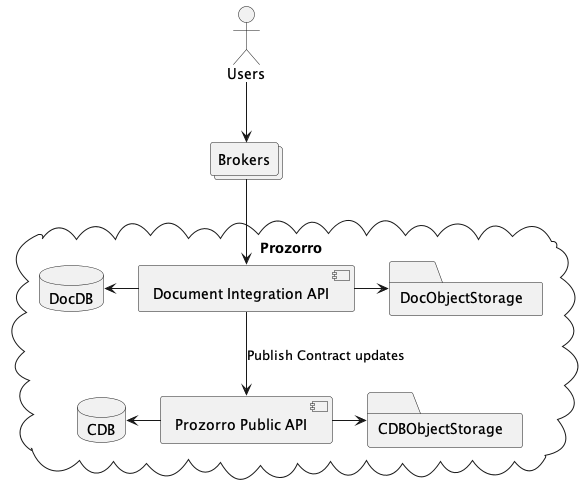
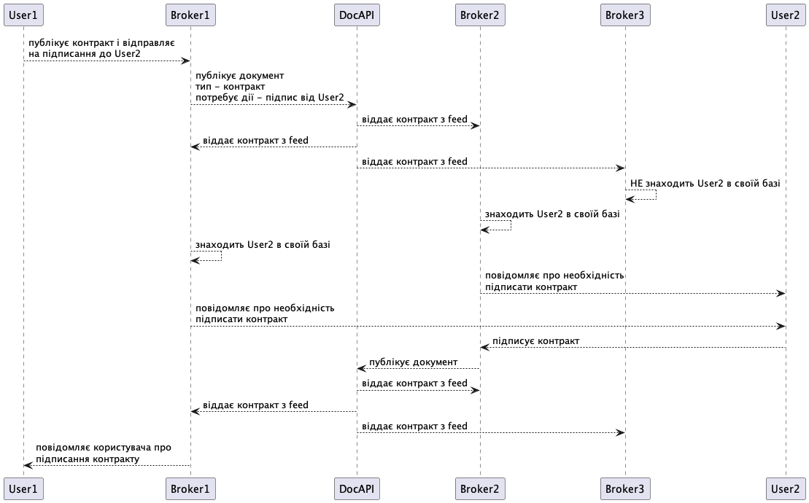
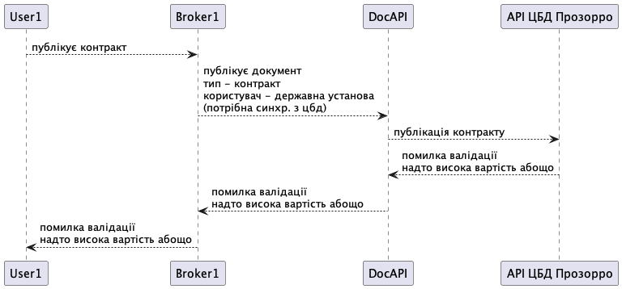

.. _contracting_electronic_documents:

Інтеграція контрактингу з системами електронного документообігу
===============================================================

КОНТЕКСТ в якому ми вирішуємо задачу/приймаємо рішення
------------------------------------------------------

Системи електронного документообігу вже широко використовутся для підписання контрактів.
Мають великий досвід, служби підтримки і клієнтську базу.
Для Прозорро в першу чергу важливо отримувати інформацію для публікації на порталі,
тому функціональності взаємодії між користувачами і зручність користування часто вирішуєтся в останню чергу.
Для користувачів було б зручніше використовувати надійні перевірені продукти,
а для Прозорро - отримувати необхідну інформацію від таких продуктів. A win-win situation.

ПРОБЛЕМА яка вирішується
------------------------
Існє декілька систем електронного документообігу,
а вибір однієї з них надав би їй перевагу над іншими.
Однією з фанкцій Прозорро є також забезпечення чесної конкуренції серед майданчиків.
Отже необхідно забезпечити можливість користувачу користуватися будь-якою (або декількома)
системами електронного документообігу, що забажали інтегруватися з Прозорро.
Також сама інтеграція має бути простою і надійною.

Драйвери прийняття рішення
--------------------------

- Підтримка і розвиток "електронного контрактингу" в Прозорро. Покращення якості даних.
- Зменшення навантаження на команди розробки Прозорро і майданчиків.
- Залучення нових партнерів і клієнтів (систем документообігу і їх клієнтів).
- Репутаційний плюс для Прозорро за вклад в "електронізацію" держави.
- Не всі дані обміну між системами можуть бути публічними.

Розглянуті варіанти
-------------------

В будь-якому варіанті Прозорро буде надавати сервіс для систем документообігу,
який дозволить публікувати документи контрактів.
Ці контракти можуть бути на різних стадіях свого життєвого циклу.
Інші системи зможуть побачити такі документи і передати на перегляд/підписання своїм користувачам.
Дані контрактингу (з "електронними" полями) мають бути опубліковані на порталі Прозорро.

Зараз користувачі через майданчик створюють, редагують, підписують договори і завантажуть в апі ЦБД.
АПІ валідує можливість і порядок дій користувача.
Будь-яка функціональність пов'язана з контрактами в на майданчиках або системах електронного документобігу,
спершу реалізуєтся на стороні апі: поля, валідації, ендпоінти.
Це забезпечує однаковий і очікуваний життєвий цикл документа.

Користувач може спробувати опублікувати драфт контракту зі свого майданчика,
потім з першої системи документообігу,
потім - з другої. Наприклад, щоб порівняти зручність.

Використання існуючого публічного апі контрактингу
~~~~~~~~~~~~~~~~~~~~~~~~~~~~~~~~~~~~~~~~~~~~~~~~~~

В прозорро існує апі для створення/редагування контрактів

https://prozorro-api-docs.readthedocs.io/uk/latest/contracting/index.html

На зараз робота з контрактами доступна майданчикам,
з яких було створено тендер або подано накращу пропозицію.
Інший майданчик не може створити контракт тим більше системах електронного документобігу.

Тож скоріш за все доробка буде включати можливість створення контрактів
з будь-яких акредитованих сервісів-партнерів, і обробку усіх можливих сценаріїв, які з цього випливають.

Створнення "шини обміну документами"
~~~~~~~~~~~~~~~~~~~~~~~~~~~~~~~~~~~~

Інсуюче апі вже надає можливості публікувати документи контрактів і електронні поля до них.
Однак системи документообігу не зацікавлені в публікації даних в Прозорро.
Більш цікавим для них буде варіант з сервісом,
що дозволить різним системам документообігу (і майданчикам) обмінюватися документами.
У випадку контрактів для публічних закупівель,
цей сервіс сам може підтягувати необхідні дані в Прозорро.

Сервіс обміну документами має так само визначати "електронні поля" необхідні для публікації даних в Прозорро.

Аналогічно до роботи майданчиків з АПІ ЦБД, системи документобігу можуть бачити "усі" документи і зміни через feed.
Авторизація кінцевих користувачів є відповідальністю майданчиків.

АПІ ЦБД Прозорро виконує також валідації щодо життєвого циклу контракту і тендеру.
Це не характерно для систем документообігу.
Але вимоги залишаються, тому доведется робити синхронну інтеграцію "шини" з АПІ ЦБД,
яка провалідує "електронні поля" на етапі публікації документа.

Плюси і мінуси описаних варіантів
---------------------------------

АПІ контрактингу
~~~~~~~~~~~~~~~~

Плюси:
 - працюючий звичний для майданчиків підхід
 - мінімальні необхідні доробки
 - можливість валідувати кожнен запит кодом АПІ ЦБД

Мінуси:
 - усі дані для обміну - публічні
 - можна обмінюватися лише контрактами для існуючих в системі тенедрів
 - низька вирогідність інтеграції систем документообігу

АПІ "шини обміну документами"
~~~~~~~~~~~~~~~~~~~~~~~~~~~~~

Плюси:
 - можна обмінюватися будь-якими документами між будь-якими користувачами
 - сервіс не має бути публічним

Мінуси:
 - необхідна розробка і ресурси під додатковий сервіс
 - необхідна розробка-інтеграція зі сторони майданчиків
 - скалдніше робити валідацію процедури

Обґрунтування рішення
---------------------

