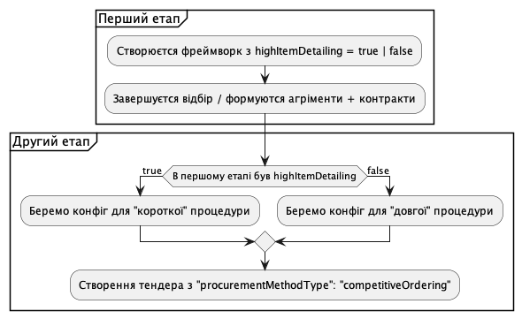

.. _dps_long_short:

DPS Long VS Short
=================

Довгі та короткі процедури DPS.

Framework
---------
У відборі (1 етап) замовник самостійно зазначає
чи він буде деталізувати предмети закупівлі на першому етапі,
чи він це зробить безпосереньо в закупівлі.
Оскільки вибір не впливає на перебіг відбору, він не є конфігом.
Це додаткове поле лише в dps фреймворках.

.. sourcecode::

    highItemDetailing = true | false

Висока деталізація закупівлі визначає,
що всі питання/скраги до предмету закупівлі будуть вирішені на першому етпапі.
Другий етап буде, відповідно, - короткий.

.. sourcecode:: http

    POST /api/2.5/frameworks HTTP/1.0
    Authorization: Bearer broker
    Content-Length: 1874
    Content-Type: application/json
    Host: lb-api-sandbox.prozorro.gov.ua

    {
      "data": {
        "highItemDetailing": true,
        "frameworkType": "dynamicPurchasingSystem",
         ...
      }
    }

    HTTP/1.0 201 Created
    Content-Type: application/json
    Location: http://lb-api-sandbox.prozorro.gov.ua/api/2.5/frameworks/4178f66eebf04c4497d0fb223feeb0fe

    {
      "data": {
        "status": "draft",
        "highItemDetailing": true,
        "frameworkType": "dynamicPurchasingSystem",
        ...
    }

На другому етапі
створення закупівлі буде вимагати різні параметри закупівлі.
(Хоче це все ще один procurementMethodType)

Якщо перший етап мав детальний опис ("highItemDetailing": true),
то закупівля буде скороченою без оскарження.

.. sourcecode:: http

    POST /api/2.5/tenders  HTTP/1.0
    Authorization: Bearer broker
    Content-Type: application/json
    Host: lb-api-sandbox.prozorro.gov.ua

    {
      "data": {
        "procurementMethodType": "competitiveOrdering",
        "agreements": [
          {
            "id": "4178f66eebf04c4497d0fb223feeb0fe"
          }
        ],
        ...
      },
      "config": {
         "tenderPeriodMinDays": 3,
         "tenderComplaints": false,
         "tenderClaims": false,
         "awardComplaints": false,
         "awardClaims": false,
         "cancellationComplaints": false,
         ...
      }
    }

Якщо ж перший етап не був детальним ("highItemDetailing": false),
то закупівля буде довгою.

.. sourcecode:: http

    POST /api/2.5/tenders  HTTP/1.0
    Authorization: Bearer broker
    Content-Type: application/json
    Host: lb-api-sandbox.prozorro.gov.ua

    {
      "data": {
        "procurementMethodType": "competitiveOrdering",
        "agreements": [
          {
            "id": "4178f66eebf04c4497d0fb223feeb0fe"
          }
        ],
        ...
      },
      "config": {
         "tenderPeriodMinDays": 7,
         "tenderComplaints": true,
         "tenderClaims": true,
         "awardComplaints": true,
         "awardClaims": true,
         "cancellationComplaints": true,
         ...
      }
    }

Вищевказані конфіги мають різні значення відповідно до деталізації першого етапу.
І можуть бути винесені в окоремі файли в стандартах.

Отут можна ознайомитись з запропонованими змінами до стандартів
https://github.com/ProzorroUKR/standards/pull/203/files

Тут видно, що для процедури competitiveOrdering.json
вцілому є два значення

.. sourcecode::

    "tenderPeriodMinDays": {
      "type": "integer",
      "enum": [
        7,
        3
      ],
      "default": 7
    },

то в окремому фалйлі для довгої процедури
'competitiveOrdering.long.json' буде одне

.. sourcecode::

    "tenderPeriodMinDays": {
      "type": "integer",
      "enum": [
        7
      ],
      "default": 7
    },

Але це все ще один "procurementMethodType: competitiveOrdering"

First iteration - DPS Short
----------------------------
Для першої ітерації стоїть задача реалізувати на другому етапі виключно скорочену процедуру, а саме тендер, який не містить оскарження у вигляді подання скарг до АМКУ на будь якому етапі, де таке оскарження виникає.

Для цього будуть використанні наступні конфіги - параметри, що визначають наявність або відсутність у закупівлі оскарження в тендері:

* tenderComplaints - оскарження умов ТД

* awardComplaints - оскарження рішення по кваліфікації

* cancellationComplaints - оскарження скасування тендеру

Запитання/вимоги як функціонал лишаються та відбувається за процесом, притаманним ВТО.

Для скороченої процедури без оскарження ці параметри будуть мати одне тільки значення `False`:

.. sourcecode:: http

    POST /api/2.5/tenders  HTTP/1.0
    Authorization: Bearer broker
    Content-Type: application/json
    Host: lb-api-sandbox.prozorro.gov.ua

    {
      "data": {
        "procurementMethodType": "competitiveOrdering",
        "agreements": [
          {
            "id": "4178f66eebf04c4497d0fb223feeb0fe"
          }
        ],
        ...
      },
      "config": {
         "tenderComplaints": false,
         "awardComplaints": false,
         "cancellationComplaints": false,
         ...
      }
    }

При створенні закупівлі не буде додаватися `complaintPeriod` автоматично, як це працює зараз в відкритих торгах з особливостями. І тому при спробі подати скаргу на умови ТД користувач буде отримувати помилку:

.. sourcecode:: http

    POST /api/2.5/tenders/1218f66eebf04c4497d0fb223feeb121/complaints HTTP/1.0
    Authorization: Bearer broker
    Content-Type: application/json
    Host: lb-api-sandbox.prozorro.gov.ua

    {
      "data": {
        ...
      }
    }

    HTTP/1.0 403 Forbidden
    Content-Type: application/json

    {
      "status": "error",
      "errors": [
        {
          "location": "body",
          "name": "data",
          "description": "Can't add complaint as procedure doesn't have complaintPeriod"
        }
      ]
    }

Схожі помилки будуть при поданні скарги на рішення по кваліфікації та скарги на скасування тендеру.