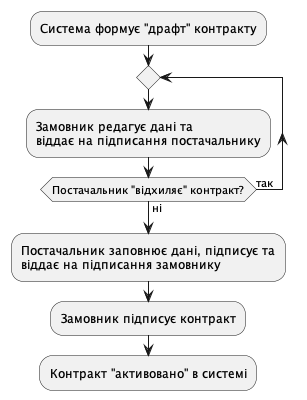
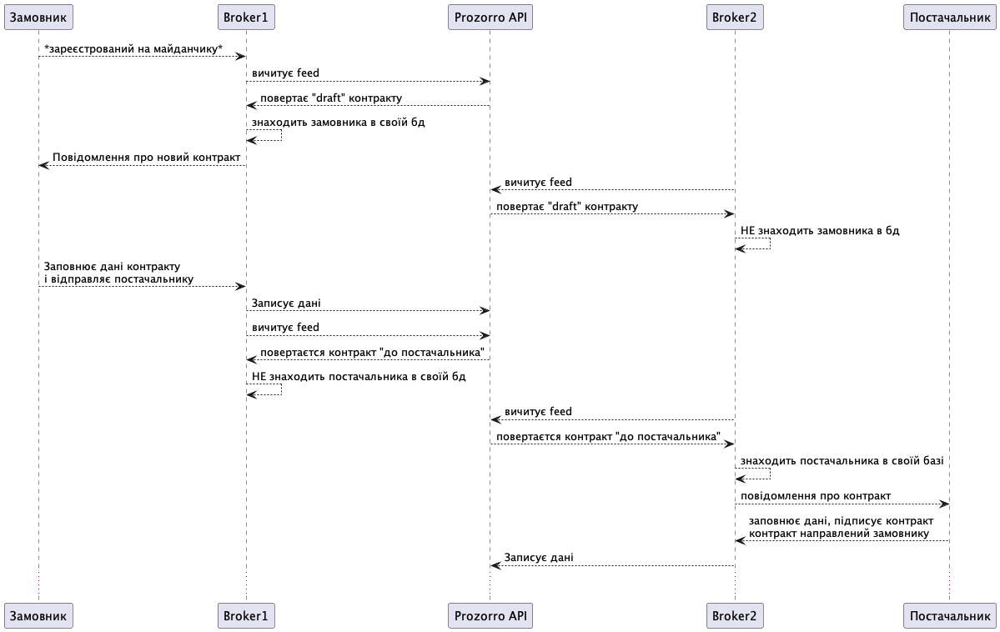

Підписання електронного контракту
=================================

Скоуп функціональності
----------------------

Цей документ покриває базовий функціонал підпису електронного контракту замовником і постачальником.
Нижче буде описаний механізм взаємодії майданчиків з АПІ ЦБД для реалізації даного процесу.

Шина обміну - фід контрактів
----------------------------

АПІ ЦБД виступає посередником між майдинчиками.
На діаграмі нижче помазаний приклад інтеграції і взаємодії між учасниками процесу.

Майданчики користуються фідом по контрактам, щоб підтягнути оновлення.
Фід дозволяє усі сторонам "бачити" апдейти як тільки ті внесені в ЦБД.

.. sourcecode:: http

    GET /api/2.5/contracts?opt_fields=status HTTP/1.0
    Host: public-api-sandbox.prozorro.gov.ua

    HTTP/1.0 200 OK
    Content-Type: application/json

    {
        "data": [
            {
                "status": "pending",
                "dateModified": "2024-05-12T08:27:55.026619+03:00",
                "id": "d5b73ce2bdc3426a86871a99a6cffcb6"
            },
            {
                "dateModified": "2024-05-12T07:45:08.834444+03:00",
                "status": "active",
                "id": "509fe127752a41fab9304a33623e507d"
            },
            {
                "dateModified": "2024-05-12T06:08:25.195462+03:00",
                "status": "active",
                "id": "9863d4377e7b4721b1ae02d8f4be08d9"
            },
        ],
        "next_page": {
            "offset": 1715446569.779,
            "path": "/api/2.5/contracts?descending=1&opt_fields=status&offset=1715446569.779",
            "uri": "https://public.api.openprocurement.org/api/2.5/contracts?descending=1&opt_fields=status&offset=1715446569.779"
        },
        "prev_page": {
            "offset": 1715491675.028,
            "path": "/api/2.5/contracts?opt_fields=status&offset=1715491675.028",
            "uri": "https://public.api.openprocurement.org/api/2.5/contracts?opt_fields=status&offset=1715491675.028"
        }
    }

Допоки контракт формуєтся автоматично, читання фіду контрактів буде достатньо
для імплементації процессу підписання.

**Важливо**: Скоріш за все майданчикам буде краще "запам'ятовувати" усі контракти з фіду,
оскільки клієнт (замовник чи постачальник) може зареєструватися на їх платформі пізніше.

Відображення контракта - Замовник
---------------------------------

.. raw:: html

    
    

.. role:: orange
.. role:: red

:orange:`Тріггер №1: Поява pending контракта`

Майданчику необхідно відобразити замовнику "попередній перегляд майбутнього контракту".

Майданчик отримає попередньо заповнену інформацію контракту від апі

.. sourcecode:: http

    GET /api/2.5/contracts/c503bd32d67b4bb895fe50cce285bac5 HTTP/1.0
    Host: public-api-sandbox.prozorro.gov.ua

    HTTP/1.0 200 OK
    Content-Type: application/json

    {
      "data": {
        "awardID": "c220713cbd024586b6382ef97a852dc7",
        "contractID": "UA-2023-10-10-000001-a-1",
        "contractTemplateName": "00000000-0.0001.01",
        "suppliers": [
          {
            "name": "Державне управління справами",
            "identifier": {
              "scheme": "UA-EDR",
              "id": "00037256",
              "uri": "http://www.dus.gov.ua/"
            },
            "address": {
              "streetAddress": "вул. Банкова, 11, корпус 1",
              "locality": "м. Київ",
              "region": "м. Київ",
              "postalCode": "01220",
              "countryName": "Україна"
            },
            "scale": "micro"
          }
        ],
        "owner": "broker",
        "tender_id": "fd45af80ad9f4574994f7f6254012693",
        "items": [
          {
            "id": "a23a71262ac642b88f2fdb69011d74b1",
            "description": "Комп’ютерне обладнання",
            "quantity": 5.0,
            "classification": {
              "description": "Cartons",
              "scheme": "ДК021",
              "id": "44617100-9"
            },
            "additionalClassifications": [
              {
                "scheme": "INN",
                "id": "17.21.1",
                "description": "папір і картон гофровані, паперова й картонна тара"
              }
            ],
            "deliveryAddress": {
              "streetAddress": "вул. Банкова 1",
              "locality": "м. Київ",
              "region": "м. Київ",
              "postalCode": "79000",
              "countryName": "Україна"
            },
            "deliveryDate": {
              "startDate": "2023-10-12T01:00:00+03:00",
              "endDate": "2023-10-15T01:00:00+03:00"
            },
            "unit": {
              "name": "кг",
              "value": {
                "amount": 6.0,
                "currency": "UAH",
                "valueAddedTaxIncluded": true
              },
              "code": "KGM"
            }
          },
          {
            "id": "c8f30df33ae14c65b38931d68e63d757",
            "description": "Комп’ютерне обладнання",
            "quantity": 5.0,
            "classification": {
              "description": "Cartons",
              "scheme": "ДК021",
              "id": "44617100-9"
            },
            "additionalClassifications": [
              {
                "scheme": "INN",
                "id": "17.21.1",
                "description": "папір і картон гофровані, паперова й картонна тара"
              }
            ],
            "deliveryAddress": {
              "streetAddress": "вул. Банкова 1",
              "locality": "м. Київ",
              "region": "м. Київ",
              "postalCode": "79000",
              "countryName": "Україна"
            },
            "deliveryDate": {
              "startDate": "2023-10-12T01:00:00+03:00",
              "endDate": "2023-10-15T01:00:00+03:00"
            },
            "unit": {
              "name": "кг",
              "value": {
                "amount": 6.0,
                "currency": "UAH",
                "valueAddedTaxIncluded": true
              },
              "code": "KGM"
            }
          }
        ],
        "buyer": {
          "name": "Державне управління справами",
          "identifier": {
            "scheme": "UA-EDR",
            "id": "00037256",
            "uri": "http://www.dus.gov.ua/"
          },
          "address": {
            "streetAddress": "вул. Банкова, 11, корпус 1",
            "locality": "м. Київ",
            "region": "м. Київ",
            "postalCode": "01220",
            "countryName": "Україна"
          },
          "kind": "general"
        },
        "value": {
          "amount": 500.0,
          "currency": "UAH",
          "valueAddedTaxIncluded": true,
          "amountNet": 500.0
        },
        "bid_owner": "broker",
        "status": "pending",
        "dateCreated": "2023-10-10T01:00:00+03:00",
        "dateModified": "2023-10-10T01:00:00+03:00",
        "id": "c503bd32d67b4bb895fe50cce285bac5"
      },
      "config": {
        "restricted": false
      }
    }

З відповіді майданчик підтягує наступні поля (структурa :ref:`Contract`):

1. Інформація по контракту:
    Загальні відомості про контракт

    - До якого тендеру належить контракт (ідентифікатор) - не редагується - **tender_id**
    - Вартість контракту і ПДВ - не редагується - **value**

2. Інформація про предмет закупівлі - **items**
    - Опис предмету закупвлі - редагується - **items.description**
    - Класифікація предмету закупівлі по коду ДК - не редагується - **items.classification**
    - Додаткова класифікація предмету закупівлі, якщо існує - не редагується - **items.additionalClassifications**
    - Адрес поставки - не редагується - **items.deliveryAddress**
    - Дата поставки (паралельна розробка) - **items.deliveryDate**
    - Характеристики предмету закупівлі - **items.attributes**

        - Назва характеристики - **items.attributes.name**
        - Значення характеристики - **items.attributes.values**
        - Одиниця виміру характеристики  - **items.attributes.unit**

    - Кількість предмету закупівлі - не редагується - **items.quantity**
    - Одиниця виміру предмету закупівлі - не редагується - **items.unit**

3. Інформація по замовнику - **buyer**
    - Ідентифікатор організації (ЕДРПОУ) - не редагується - **buyer.identifier**
    - Назва організації - не редагується - **buyer.name**, **buyer.name_en**
    - Адреса організації - не редагується - **buyer.address**

4. Інформація по постачальнику - **suppliers**
    - Ідентифікатор організації (ЕДРПОУ) - не редагується - **suppliers.identifier**
    - Назва організації - не редагується - **suppliers.name**
    - Адреса організації - не редагується - **suppliers.address**

5. Інформація про шаблон контракту **contractTemplateName**

Замовник має додати інформацію про підписанта
---------------------------------------------

Замовник має додати інформацію про підписанта, а саме:

- ПІБ підписанта
- Посада підписанта
- Імейл підписанта
- Телефон підписанта
- Реквізити організації (ІБАН)

.. sourcecode:: http

    PUT /api/2.5/contracts/c503bd32d67b4bb895fe50cce285bac5/buyer/signer_info?acc_token=3b095197e5f94f76a28bae3a3079c206 HTTP/1.0

    Authorization: Bearer broker
    Content-Type: application/json
    Host: lb-api-sandbox.prozorro.gov.ua

    {
      "data": {
        "name": "Test Testovich",
        "telephone": "+380950000000",
        "email": "example@email.com",
        "iban": "UA111111111111111",
        "authorizedBy": "Статут компанії",
        "position": "Генеральний директор"
      }
    }

    HTTP/1.0 200 OK
    Content-Type: application/json

    {
      "data": {
        "name": "Test Testovich",
        "email": "example@email.com",
        "telephone": "+380950000000",
        "iban": "UA111111111111111",
        "position": "Генеральний директор",
        "authorizedBy": "Статут компанії"
      }
    }

Контракт відправляється постачальнику
-------------------------------------

:orange:`Тріггер №2: Поява в контракті даних підписанта Замовника`

    Після перевірки що вся інформація заповнена вірно,
    замовник направляє контракт постачальнику
    для заповнення інформацією про підписанта з його сторони
    (прив'язка до ЕДРПОУ постачальника який є в контракті)

В структурі даних АПІ не обов'язково мати інформацію про "направлення" контракта замовнику,
бо це частина функціоналу систем документообігу.
На зараз у нас є лише один флоу,
в якому після надання Замовником необхіодної інформації,
постачальник може надавати свою та підписувати документ.

Постачальник надає інформацію про підписанта
--------------------------------------------

Майданчик може проінформаувати Постачальника, про контракт і той факт,
що Замовник заповнив інформацію про підписанта.
Тож замовник і сам має заповнити свою частину інформації про підписанта.
(В АПІ немає валідації саме на послідовність, тож майданчики можуть одночасно запитувати цю інформацію у користувачів)

.. sourcecode:: http

    PUT /api/2.5/contracts/c503bd32d67b4bb895fe50cce285bac5/suppliers/signer_info?acc_token=e83ced17c21845f6b06d197ccd74988d HTTP/1.0

    Authorization: Bearer broker
    Content-Type: application/json
    Host: lb-api-sandbox.prozorro.gov.ua

    {
      "data": {
        "name": "Test Testovich",
        "telephone": "+380950000000",
        "email": "example@email.com",
        "iban": "UA22222222222222222222222",
        "authorizedBy": "Статут компанії",
        "position": "Генеральний директор"
      }
    }

    HTTP/1.0 200 OK
    Content-Type: application/json

    {
      "data": {
        "name": "Test Testovich",
        "email": "example@email.com",
        "telephone": "+380950000000",
        "iban": "111111111111111",
        "position": "Генеральний директор",
        "authorizedBy": "Статут компанії"
      }
    }

Постачальник підписує контракт
------------------------------

Підписання контракту відбувається на стороні майданчика засобами майданчика.

В апі ЦБД завантажуються результуючі файли:
- файл контракту
- файл підпису

Постачальник завантажує файл контракту
~~~~~~~~~~~~~~~~~~~~~~~~~~~~~~~~~~~~~~

Файл контракту створюється на стороні майданчика з **темплейта**
доповненого електронними полями з json контракту.

**TBA: реєстр темплейтів**

Оскільки по запропонованому флоу останні дані (дані підписанта) вводить Постачальник,
то саме майданчик постачальника завантажить документ контракту в АПІ ЦБД

.. sourcecode:: http

    POST /api/2.5/contracts/c503bd32d67b4bb895fe50cce285bac5/documents?acc_token=3b095197e5f94f76a28bae3a3079c206 HTTP/1.0

    Authorization: Bearer broker
    Content-Type: application/json
    Host: lb-api-sandbox.prozorro.gov.ua

    {
      "data": {
        "title": "contract.pdf",
        "documentType": "contractSigned",
        "url": "http://public-docs-sandbox.prozorro.gov.ua/get/1ea9c5fa82c84b2a8206318bc86360df?Signature=y%2Bc%2FV%2BSIqnf36NvLLrimQyaWUtCCEZEgtEl%2FsALE5XH5bqEoXwnwNhAkhsKg1JfVY9%2BEwvXxHKhaD5p%2BZBhCBw%3D%3D&KeyID=a8968c46",
        "hash": "md5:00000000000000000000000000000000",
        "format": "application/pdf"
      }
    }

    HTTP/1.0 201 Created
    Content-Type: application/json
    Location: http://lb-api-sandbox.prozorro.gov.ua/api/2.5/contracts/c503bd32d67b4bb895fe50cce285bac5/documents/08682b48035643a39d924df55eb915e0

    {
      "data": {
        "id": "08682b48035643a39d924df55eb915e0",
        "hash": "md5:00000000000000000000000000000000",
        "title": "contract.pdf",
        "documentType": "contractSigned",
        "format": "application/pdf",
        "url": "http://public-docs-sandbox.prozorro.gov.ua/get/1ea9c5fa82c84b2a8206318bc86360df?Signature=x6tzZwzV4d5DGLeiqvD%2Bm0EdAUGgzUmYnoQ4AjImnxjQRU49JnE3aq50UHtPUVvIRfF5JSrLqmyF3tssHOT%2BCA%3D%3D&KeyID=a8968c46",
        "documentOf": "contract",
        "datePublished": "2023-10-10T01:00:00+03:00",
        "dateModified": "2023-10-10T01:00:00+03:00"
      }
    }

**Важливо**: має бути валідація, щоб тільки один документ типу 'contractSigned'
був в переліку документів.
А також обидві сторони матимуть можливіть
завантажити нову версію (PUT) такого документа.

Постачальник завантажує файл підпису контракту
~~~~~~~~~~~~~~~~~~~~~~~~~~~~~~~~~~~~~~~~~~~~~~

.. sourcecode:: http

    POST /api/2.5/contracts/c503bd32d67b4bb895fe50cce285bac5/documents?acc_token=3b095197e5f94f76a28bae3a3079c206 HTTP/1.0

    Authorization: Bearer broker
    Content-Type: application/json
    Host: lb-api-sandbox.prozorro.gov.ua

    {
      "data": {
        "title": "sign.p7s",
        "documentType": "signature",
        "documentOf": "contractDocument",
        "relatedItem": "08682b48035643a39d924df55eb915e0",
        "url": "http://public-docs-sandbox.prozorro.gov.ua/get/1ea9c5fa82c84b2a8206318bc86360df?Signature=y%2Bc%2FV%2BSIqnf36NvLLrimQyaWUtCCEZEgtEl%2FsALE5XH5bqEoXwnwNhAkhsKg1JfVY9%2BEwvXxHKhaD5p%2BZBhCBw%3D%3D&KeyID=a8968c46",
        "hash": "md5:00000000000000000000000000000000",
        "format": "application/pkcs7-signature"
      }
    }

    HTTP/1.0 201 Created
    Content-Type: application/json
    Location: http://lb-api-sandbox.prozorro.gov.ua/api/2.5/contracts/c503bd32d67b4bb895fe50cce285bac5/documents/08682b48035643a39d924df55eb915e0

    {
      "data": {
        "id": "9438d93a59264568b75f95c5de5c8d9b",
        "hash": "md5:00000000000000000000000000000000",
        "title": "sign.p7s",
        "documentType": "signature",
        "documentOf": "contractDocument",
        "relatedItem": "08682b48035643a39d924df55eb915e0",
        "author": "supplier",
        "format": "application/pkcs7-signature",
        "url": "http://public-docs-sandbox.prozorro.gov.ua/get/1ea9c5fa82c84b2a8206318bc86360df?Signature=x6tzZwzV4d5DGLeiqvD%2Bm0EdAUGgzUmYnoQ4AjImnxjQRU49JnE3aq50UHtPUVvIRfF5JSrLqmyF3tssHOT%2BCA%3D%3D&KeyID=a8968c46",
        "datePublished": "2023-10-10T02:00:00+03:00",
        "dateModified": "2023-10-10T02:00:00+03:00"
      }
    }

Як результат ми маємо:
 - "contract.pdf" з типом "contractSigned"
 - "sign.p7s" з типом "signature" та полями documentOf+relatedItem, що посилаються на "contract.pdf"

Можна програмно визначити, чи є контракт підписаний постачальником, бо у файла підписа вказано `"author": "supplier"`.
У документа контракта ж немає поля "author" (або є але це не є важливим),
бо додавати / оновлювати його в різних сценаріях можуть різні сторони.

Замовник завантажує файл підпису контракту
~~~~~~~~~~~~~~~~~~~~~~~~~~~~~~~~~~~~~~~~~~

:orange:`Тріггер №3: Поява в контракті підпису постачальника`

.. sourcecode:: http

    POST /api/2.5/contracts/c503bd32d67b4bb895fe50cce285bac5/documents?acc_token=3b095197e5f94f76a28bae3a3079c206 HTTP/1.0

    Authorization: Bearer broker
    Content-Type: application/json
    Host: lb-api-sandbox.prozorro.gov.ua

    {
      "data": {
        "title": "sign.p7s",
        "documentType": "signature",
        "documentOf": "contractDocument",
        "relatedItem": "08682b48035643a39d924df55eb915e0",
        "url": "http://public-docs-sandbox.prozorro.gov.ua/get/5a3b7a2ee860772dcdc649ca1705e69f?Signature=y%2Bc%2FV%2BSIqnf36NvLLrimQyaWUtCCEZEgtEl%2FsALE5XH5bqEoXwnwNhAkhsKg1JfVY9%2BEwvXxHKhaD5p%2BZBhCBw%3D%3D&KeyID=a8968c46",
        "hash": "md5:00000000000000000000000000000000",
        "format": "application/pkcs7-signature"
      }
    }

    HTTP/1.0 201 Created
    Content-Type: application/json
    Location: http://lb-api-sandbox.prozorro.gov.ua/api/2.5/contracts/c503bd32d67b4bb895fe50cce285bac5/documents/16c04af53eb1469ea9b4bfdb4d26a1de

    {
      "data": {
        "id": "16c04af53eb1469ea9b4bfdb4d26a1de",
        "hash": "md5:00000000000000000000000000000000",
        "title": "sign.p7s",
        "documentType": "signature",
        "documentOf": "contractDocument",
        "relatedItem": "08682b48035643a39d924df55eb915e0",
        "author": "buyer",
        "format": "application/pkcs7-signature",
        "url": "http://public-docs-sandbox.prozorro.gov.ua/get/5a3b7a2ee860772dcdc649ca1705e69f?Signature=x6tzZwzV4d5DGLeiqvD%2Bm0EdAUGgzUmYnoQ4AjImnxjQRU49JnE3aq50UHtPUVvIRfF5JSrLqmyF3tssHOT%2BCA%3D%3D&KeyID=a8968c46",
        "datePublished": "2023-10-10T03:00:00+03:00",
        "dateModified": "2023-10-10T03:00:00+03:00"
      }
    }

Контракт підписаний усіма
-------------------------

:orange:`Тріггер №4: Поява в контракті підпису замовника`

.. sourcecode:: http

    GET /api/2.5/contracts/c503bd32d67b4bb895fe50cce285bac5 HTTP/1.0
    Host: public-api-sandbox.prozorro.gov.ua

    HTTP/1.0 200 OK
    Content-Type: application/json

    {
       "data":{
          "awardID":"c220713cbd024586b6382ef97a852dc7",
          "contractID":"UA-2023-10-10-000001-a-1",
          "contractTemplateName": "00000000-0.0001.01",
          "suppliers":[
             {
                "name":"Державне управління справами",
                "identifier":{
                   "scheme":"UA-EDR",
                   "id":"00037256",
                   "uri":"http://www.dus.gov.ua/"
                },
                "address":{
                   "streetAddress":"вул. Банкова, 11, корпус 1",
                   "locality":"м. Київ",
                   "region":"м. Київ",
                   "postalCode":"01220",
                   "countryName":"Україна"
                },
                "scale":"micro"
             }
          ],
          "owner":"broker",
          "tender_id":"fd45af80ad9f4574994f7f6254012693",
          "items":[
             {
                "id":"a23a71262ac642b88f2fdb69011d74b1",
                "description":"Комп’ютерне обладнання",
                "quantity":5.0,
                "classification":{
                   "description":"Cartons",
                   "scheme":"ДК021",
                   "id":"44617100-9"
                },
                "additionalClassifications":[
                   {
                      "scheme":"INN",
                      "id":"17.21.1",
                      "description":"папір і картон гофровані, паперова й картонна тара"
                   }
                ],
                "deliveryAddress":{
                   "streetAddress":"вул. Банкова 1",
                   "locality":"м. Київ",
                   "region":"м. Київ",
                   "postalCode":"79000",
                   "countryName":"Україна"
                },
                "deliveryDate":{
                   "startDate":"2023-10-12T01:00:00+03:00",
                   "endDate":"2023-10-15T01:00:00+03:00"
                },
                "unit":{
                   "name":"кг",
                   "value":{
                      "amount":6.0,
                      "currency":"UAH",
                      "valueAddedTaxIncluded":true
                   },
                   "code":"KGM"
                }
             }
          ],
          "buyer":{
             "name":"Державне управління справами",
             "identifier":{
                "scheme":"UA-EDR",
                "id":"00037256",
                "uri":"http://www.dus.gov.ua/"
             },
             "address":{
                "streetAddress":"вул. Банкова, 11, корпус 1",
                "locality":"м. Київ",
                "region":"м. Київ",
                "postalCode":"01220",
                "countryName":"Україна"
             },
             "kind":"general"
          },
          "value":{
             "amount":500.0,
             "currency":"UAH",
             "valueAddedTaxIncluded":true,
             "amountNet":500.0
          },
          "bid_owner":"broker",
          "status":"pending",
          "dateCreated":"2023-10-10T01:00:00+03:00",
          "dateModified":"2023-10-10T01:00:00+03:00",
          "id":"c503bd32d67b4bb895fe50cce285bac5",
          "documents":[
             {
                "id":"08682b48035643a39d924df55eb915e0",
                "hash":"md5:00000000000000000000000000000000",
                "title":"contract.pdf",
                "documentType":"contractSigned",
                "format":"application/pdf",
                "url":"http://public-docs-sandbox.prozorro.gov.ua/get/1ea9c5fa82c84b2a8206318bc86360df?Signature=x6tzZwzV4d5DGLeiqvD%2Bm0EdAUGgzUmYnoQ4AjImnxjQRU49JnE3aq50UHtPUVvIRfF5JSrLqmyF3tssHOT%2BCA%3D%3D&KeyID=a8968c46",
                "documentOf":"contract",
                "datePublished":"2023-10-10T01:00:00+03:00",
                "dateModified":"2023-10-10T01:00:00+03:00"
             },
             {
                "id":"9438d93a59264568b75f95c5de5c8d9b",
                "hash":"md5:00000000000000000000000000000000",
                "title":"sign.p7s",
                "documentType":"signature",
                "documentOf":"contractDocument",
                "relatedItem":"08682b48035643a39d924df55eb915e0",
                "author":"supplier",
                "format":"application/pkcs7-signature",
                "url":"http://public-docs-sandbox.prozorro.gov.ua/get/1ea9c5fa82c84b2a8206318bc86360df?Signature=x6tzZwzV4d5DGLeiqvD%2Bm0EdAUGgzUmYnoQ4AjImnxjQRU49JnE3aq50UHtPUVvIRfF5JSrLqmyF3tssHOT%2BCA%3D%3D&KeyID=a8968c46",
                "datePublished":"2023-10-10T02:00:00+03:00",
                "dateModified":"2023-10-10T02:00:00+03:00"
             },
             {
                "id":"16c04af53eb1469ea9b4bfdb4d26a1de",
                "hash":"md5:00000000000000000000000000000000",
                "title":"sign.p7s",
                "documentType":"signature",
                "documentOf":"contractDocument",
                "relatedItem":"08682b48035643a39d924df55eb915e0",
                "author":"buyer",
                "format":"application/pkcs7-signature",
                "url":"http://public-docs-sandbox.prozorro.gov.ua/get/5a3b7a2ee860772dcdc649ca1705e69f?Signature=x6tzZwzV4d5DGLeiqvD%2Bm0EdAUGgzUmYnoQ4AjImnxjQRU49JnE3aq50UHtPUVvIRfF5JSrLqmyF3tssHOT%2BCA%3D%3D&KeyID=a8968c46",
                "datePublished":"2023-10-10T03:00:00+03:00",
                "dateModified":"2023-10-10T03:00:00+03:00"
             }
          ]
       },
       "config":{
          "restricted":false
       }
    }

Відхилення підписання
---------------------

:orange:`Тріггер №5: Поява в контракті повідомлення про відхилення`

Ще до підписання, Постачальник може опублікувати рішення про "відхилення підписання".
Замовник може внести зміни до контракту і рішення стане неактуальним.
Тому саме рішення поки не буде блокуючим, це лише інформація для Замовника "чому Постачальник не підписує".

.. sourcecode:: http

    POST /api/2.5/contracts/c503bd32d67b4bb895fe50cce285bac5/rejections?acc_token=3b095197e5f94f76a28bae3a3079c206 HTTP/1.0

    Authorization: Bearer broker
    Content-Type: application/json
    Host: lb-api-sandbox.prozorro.gov.ua

    {
      "data": {
        "description": "текст причини відмови"
      }
    }

    HTTP/1.0 201 Created
    Content-Type: application/json
    Location: http://lb-api-sandbox.prozorro.gov.ua/api/2.5/contracts/c503bd32d67b4bb895fe50cce285bac5/rejections/16c04af53eb1469ea9b4bfdb4d26a1da

    {
      "data": {
        "id": "16c04af53eb1469ea9b4bfdb4d26a1da",
        "description": "текст причини відмови",
        "author": "supplier",
        "datePublished": "2023-10-10T03:00:00+03:00"
      }
    }

Контракт з "відхиленнями"

.. sourcecode:: http

    GET /api/2.5/contracts/c503bd32d67b4bb895fe50cce285bac5 HTTP/1.0
    Host: public-api-sandbox.prozorro.gov.ua

    HTTP/1.0 200 OK
    Content-Type: application/json

    {
       "data":{
          "rejections":[
             {
                "id": "16c04af53eb1469ea9b4bfdb4d26a1da",
                "description": "текст причини відмови",
                "author": "supplier",
                "datePublished": "2023-10-10T03:00:00+03:00"
              }
          ]
          "awardID":"c220713cbd024586b6382ef97a852dc7",
          "contractID":"UA-2023-10-10-000001-a-1",
          "contractTemplateName": "00000000-0.0001.01",
          "suppliers":[
             {
                "name":"Державне управління справами",
                "identifier":{
                   "scheme":"UA-EDR",
                   "id":"00037256",
                   "uri":"http://www.dus.gov.ua/"
                },
                "address":{
                   "streetAddress":"вул. Банкова, 11, корпус 1",
                   "locality":"м. Київ",
                   "region":"м. Київ",
                   "postalCode":"01220",
                   "countryName":"Україна"
                },
                "scale":"micro"
             }
          ],
          "owner":"broker",
          "tender_id":"fd45af80ad9f4574994f7f6254012693",
          "items":[
             {
                "id":"a23a71262ac642b88f2fdb69011d74b1",
                "description":"Комп’ютерне обладнання",
                "quantity":5.0,
                "classification":{
                   "description":"Cartons",
                   "scheme":"ДК021",
                   "id":"44617100-9"
                },
                "additionalClassifications":[
                   {
                      "scheme":"INN",
                      "id":"17.21.1",
                      "description":"папір і картон гофровані, паперова й картонна тара"
                   }
                ],
                "deliveryAddress":{
                   "streetAddress":"вул. Банкова 1",
                   "locality":"м. Київ",
                   "region":"м. Київ",
                   "postalCode":"79000",
                   "countryName":"Україна"
                },
                "deliveryDate":{
                   "startDate":"2023-10-12T01:00:00+03:00",
                   "endDate":"2023-10-15T01:00:00+03:00"
                },
                "unit":{
                   "name":"кг",
                   "value":{
                      "amount":6.0,
                      "currency":"UAH",
                      "valueAddedTaxIncluded":true
                   },
                   "code":"KGM"
                }
             }
          ],
          "buyer":{
             "name":"Державне управління справами",
             "identifier":{
                "scheme":"UA-EDR",
                "id":"00037256",
                "uri":"http://www.dus.gov.ua/"
             },
             "address":{
                "streetAddress":"вул. Банкова, 11, корпус 1",
                "locality":"м. Київ",
                "region":"м. Київ",
                "postalCode":"01220",
                "countryName":"Україна"
             },
             "kind":"general"
          },
          "value":{
             "amount":500.0,
             "currency":"UAH",
             "valueAddedTaxIncluded":true,
             "amountNet":500.0
          },
          "bid_owner":"broker",
          "status":"pending",
          "dateCreated":"2023-10-10T01:00:00+03:00",
          "dateModified":"2023-10-10T01:00:00+03:00",
          "id":"c503bd32d67b4bb895fe50cce285bac5"
       },
       "config":{
          "restricted":false
       }
    }

Авторизація користувачів з різних майданчиків
----------------------------------------------

Для додавання даних в ЦБД, майданчку треба буде дозвіл на такі дії.
Зараз надання дозволу надаєтся за токеном тендера. Це не спрацює,
якщо користувачі працюють з тендером на одному майданчику, а з контрактом - на іншому.

Треба механізм або "передачі" авторизації користувача між майданчиками
або універсальний механізм авторизації користувача з будь-якого майданчика (Напр https://confluence.prozorro.org/pages/viewpage.action?pageId=166854788)

Передача авторизації через Relocation
~~~~~~~~~~~~~~~~~~~~~~~~~~~~~~~~~~~~~

В ЦБД вже є варіант механізму "передачі" авторизації з майданчика на майданчик https://prozorro-api-docs.readthedocs.io/uk/master/relocation/contracts.html#example-for-contract

Ось як він може виглядати на діаграмі

Його можна допрацювати / спростити для зручності/можливості використання:
 - Дозволити переносити кортакти в статусі pending
 - Приймати transfer токен не тільки контракта, а й тендера, щоб опціонально прибрати перший крок для майданчика 1
 - Зробити напівавтоматичну "передачу" transfer токена від одного майданчика до іншого

*Плюси*:
 - Механізм забезпечує необхідну ступінь авторизації,  вже є частиною ЦБД і вкладаєтся в загальну архітектуру.

*Мінуси*
 - Представники майданчиків висловились, що схема надто складна. Майже ніхто не реалізовував механізм relocation, тому це додаткова розробка.

Найбільш простий варіант, що тим не менш базується на токенах
~~~~~~~~~~~~~~~~~~~~~~~~~~~~~~~~~~~~~~~~~~~~~~~~~~~~~~~~~~~~~
Механізм автентифікації та авторизації кінцевих користувачів завжди був делегований на майданчики.
Усі перевірки ЕЦП, телефонів, імейлів робить саме майданчик.

ЦБД повертає токени доступу до об'єктів, як правило, тим майданчикам, з яких було створено конкретний об'єкт.
Але від цього можна відійти, і для контрактів видавати токен першому майданчику, з якого користувач забажав працювати з конкретним контрактом.

Як це має виглядати

.. image:: img/e_contract_signing/e_contract_simple_signing_sequence.png

Таким чином ми зберігаємо можливість кожному користувачу/стороні контраку обирати
де, вони будуть працювати з контрактом.
Але так само гарантуєм, що два майданчики одночасно не працюють від імені одного користувача з одним об'єктом.

:orange:`Важливо: Майданчики мають отримувати токен лише на запит користувача.`

Механізм складаєтся з двох кроків для підтримки :ref:`2pc` (read `more <https://en.wikipedia.org/wiki/Two-phase_commit_protocol>`_)
Тому реалізація апі буде виглядати як два запити:

.. sourcecode:: http

    POST /api/2.5/contracts/c503bd32d67b4bb895fe50cce285bac5/access HTTP/1.0
    Host: public-api-sandbox.prozorro.gov.ua

    {
       "data":{
         "identifier":{
            "scheme":"UA-EDR",
            "id":"00037256",
         }
      }
    }

    HTTP/1.0 200 OK
    Content-Type: application/json

    {
       "data":{
         "identifier":{
            "scheme":"UA-EDR",
            "id":"00037256",
         },
         "active": False,
      },
      "access": {
        "token": "d449625b66ae44b0a591b8551cfd1bfe",
        "transfer": "da2cfe17ad6546cc910d2b3750b2830c"
      }
    }

.. sourcecode:: http

    PUT /api/2.5/contracts/c503bd32d67b4bb895fe50cce285bac5/access?acc_token=d449625b66ae44b0a591b8551cfd1bfe HTTP/1.0
    Host: public-api-sandbox.prozorro.gov.ua

    {
       "data":{
        "identifier":{
            "scheme":"UA-EDR",
            "id":"00037256",
         },
         "active": True,
      }
    }

    HTTP/1.0 200 OK
    Content-Type: application/json

    {
       "data":{
         "identifier":{
            "scheme":"UA-EDR",
            "id":"00037256",
         },
         "active": True,
      }
    }

*Плюси*:
 - Простий механізм, не потрібно взаємодій між майданчиками.

*Мінуси*
 - При неправільній імпліментації керування може отримувати або неправильний користувач, або неочікуваний для користувача майданчик
