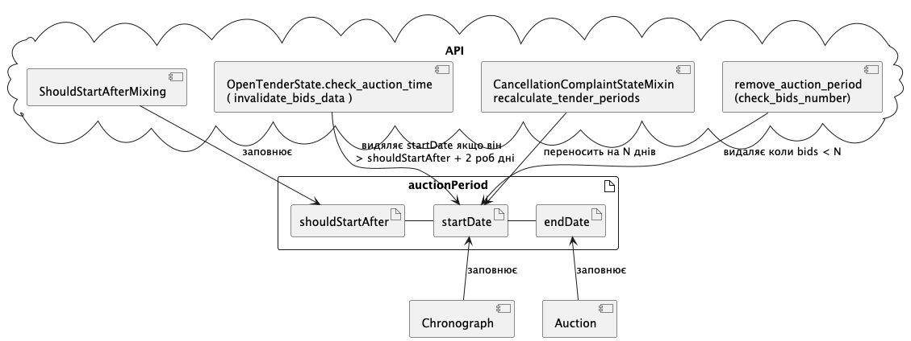
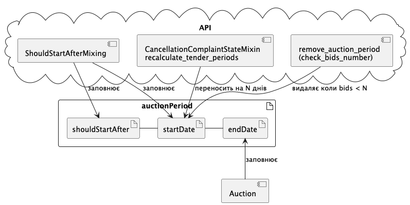

.. _auction_planning_change:

Зміни до планування дат аукціонів
=================================

Поточний процес
---------------

Нараз планування дати аукціона `auctionPeriod.startDate` виконують поетапно два сервіси. Спочатку АПІ ЦБД розраховує `auctionPeriod.shouldStartAfter`, який як правило є датою завершення подачі пропозицій або прекваліфікації.

Далі окремий спеціальний сервіс "Планувальник аукціонів" (який є частиною проекта Chronograph) підшукує дату після `auctionPeriod.shouldStartAfter`.

Після чого дата додається до АПІ ЦБД окремим запитом від імені Chronograph

Мотивація до змін
-----------------

Наразі (відповідно до окремого дослідження) "Планувальник аукціонів" сконфігуровано на ліміт **800 аукціонів щопівгодини**. А реально плануються до 200. Що означає, що ліміт наразі не використовуєтся. Планувальник, нажаль, працює дуже погано коли справді утикається в ліміт і змушений планувати на наступний робочий день, тому його "пришвидшили" і тепер він просто планує аукціони на наступний робочий день.

Тож причини прибрати окремий сервіс для планування наступні:

- зробити планування надійним і миттєвим

- спростити підтримку коду по плануванню аукціонів

Новий підхід
------------

АПІ ЦБД після обрахування `auctionPeriod.shouldStartAfter`, може спланувати `auctionPeriod.startDate` на робочі години (з 10 до 16). Для того щоб аукціони не починались одночасно буде використана рандомізація.

Таким чином результат має бути аналогічним поточному.

Також ми видаляємо логіку функцію `OpenTenderState.check_auction_time`, яка викликається з `invalidate_bids_data`. Вона видаляла дату початку аукціону при інвалідації пропозицій , якщо дата початку аукціона була більше чим на 2 дні більшою за `auctionPeriod.shouldStartAfter`. (Хіба що ми найдемо раціональне пояснення цій поведінці)

