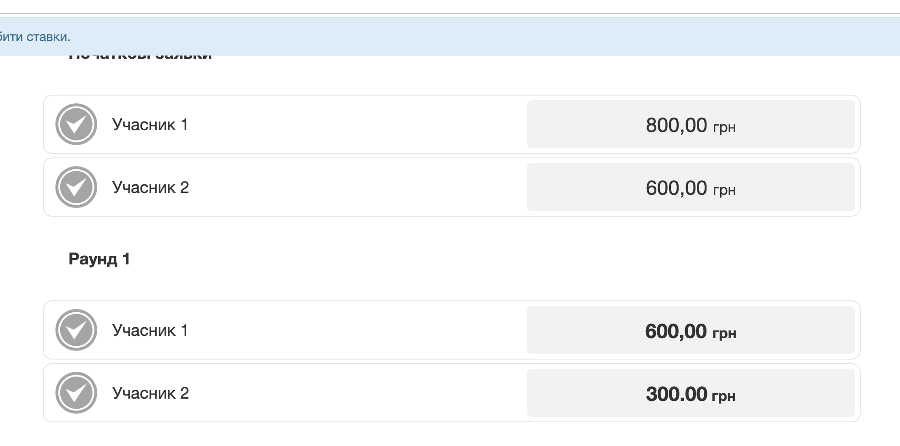
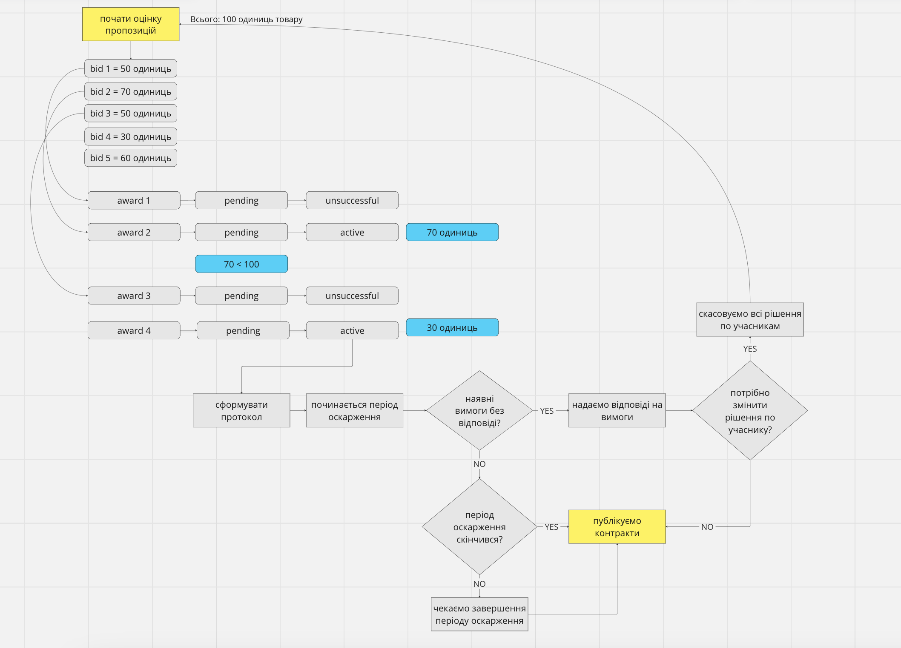

.. _collective_quantity_tender:

Collective Quantity Procedure
=============================

So called "Біржові торги".

Creating tender
---------------

`awardingByItemUnitValue` configuration can enable this type of procedure.
There is a requirement that can be only one item per lot.

.. sourcecode:: http

  POST /api/2.5/tenders?opt_pretty=1 HTTP/1.0

  Authorization: Bearer broker
  Content-Length: 2918
  Content-Type: application/json
  Host: lb-api-sandbox.prozorro.gov.ua
  {
    "data": {
      "title": "футляри до державних нагород",
      "mainProcurementCategory": "goods",
      "value": {
        "amount": 500,
        "currency": "UAH"
      },
      "lots": [
        {
          "title": "Єдиний Лот",
          "description": "Опис Лот",
          "status": "active",
          "id": "eb3a2c7480d14c948cce6d516a8fb007",
          "date": "2023-01-01T00:00:00+02:00",
          "value": {
            "amount": 500.0,
            "currency": "UAH",
            "valueAddedTaxIncluded": true
          },
          "minimalStep": {
            "amount": 5.0,
            "currency": "UAH",
            "valueAddedTaxIncluded": true
          }
        }
      ],
      "items": [
        {
          "id": "df827a0a87354ad59f985d4b31bbaf6c",
          "relatedLot": "eb3a2c7480d14c948cce6d516a8fb007",
          "description": "футляри до державних нагород",
          ..
        },
        {
          "id": "2f821a0a87354ad59f985d4b31ab5f6f",
          "relatedLot": "eb3a2c7480d14c948cce6d516a8fb007",
          "description": "пдіставки до державних нагород",
          ...
        }
      ],
      ...
    },
    "config": {
      "awardingByItemUnitValue": true,
      ...
    }
  }

  HTTP/1.0 422 Unprocessable Entity
  Content-Type: application/json
  {
    "status": "error",
    "errors": [
      {
        "location": "body",
        "name": "data",
        "description": "Expecting 1 item per lot if awardingByItemUnitValue is true"
      }
    ]
  }

There can be only one item per lot

.. sourcecode:: http

  POST /api/2.5/tenders?opt_pretty=1 HTTP/1.0

  Authorization: Bearer broker
  Content-Length: 2918
  Content-Type: application/json
  Host: lb-api-sandbox.prozorro.gov.ua
  {
    "data": {
      "title": "футляри до державних нагород",
      "mainProcurementCategory": "goods",
      "value": {
        "amount": 500,
        "currency": "UAH"
      },
      "lots": [
        {
          "title": "Лот №1",
          "description": "Опис Лот №1",
          "status": "active",
          "id": "eb3a2c7480d14c948cce6d516a8fb007",
          "date": "2023-01-01T00:00:00+02:00",
          "value": {
            "amount": 500.0,
            "currency": "UAH",
            "valueAddedTaxIncluded": true
          },
          "minimalStep": {
            "amount": 5.0,
            "currency": "UAH",
            "valueAddedTaxIncluded": true
          }
        },
        {
          "title": "Лот №2",
          "description": "Опис Лот №2",
          "status": "active",
          "id": "03db38a8519e40fc9fc9377793126015",
          "date": "2023-01-01T00:00:00+02:00",
          "value": {
            "amount": 500.0,
            "currency": "UAH",
            "valueAddedTaxIncluded": true
          },
          "minimalStep": {
            "amount": 5.0,
            "currency": "UAH",
            "valueAddedTaxIncluded": true
          }
        }
      ],
      "items": [
        {
          "id": "43204fd932374740a40528f7712ca55e",
          "description": "Книжки",
          "unit": {
            "name": "кілограм",
            "value": {
              "amount": 10.0,
              "currency": "UAH",
              "valueAddedTaxIncluded": true
            },
            "code": "KGM"
          },
          "quantity": 100,
          "relatedLot": "eb3a2c7480d14c948cce6d516a8fb007",
          ...
        },
        {
          "id": "d81485ce6a9d4b6c8842d1c3c2fbae01",
          "description": "Журнали",
          "unit": {
            "name": "кілограм",
            "value": {
              "amount": 6.0,
              "currency": "UAH",
              "valueAddedTaxIncluded": true
            },
            "code": "KGM"
          },
          "quantity": 200,
          "relatedLot": "03db38a8519e40fc9fc9377793126015",
          ...
        }
      ],
      ...
    },
    "config": {
      "awardingByItemUnitValue": true,
      ...
    }
  }

  HTTP/1.0 201 Created

Creating bid
------------
There are differences in the bid model:

  - ``value`` is forbidden or ignored
  - ``items`` array is required
  - ``items`` contains only ``id``, ``unit`` and ``quantity`` fields
  - ``items.id`` should be one of tender item ids
  - ``bid.items.unit`` contains only ``value`` fields
  - ``bid.items.quantity`` should be less or equal to tender ``items.quantity`` TBD

.. sourcecode:: http

  POST /tenders/64e93250be76435397e8c992ed4214d1/bids HTTP/1.1

  Content-Type: application/json
  {
    "data": {
      "tenderers": ...,
      "lotValues": [
        {
          "subcontractingDetails": "ДКП «Орфей», Україна",
          "relatedLot": "eb3a2c7480d14c948cce6d516a8fb007",
          "items": [
            {
              "id": "43204fd932374740a40528f7712ca55e",
              "unit": {
                "value": {
                  "amount": 800
                }
              },
              "quantity": 50
            }
          ],
        },
        {
          "subcontractingDetails": "ДКП «Орфей», Україна",
          "relatedLot": "03db38a8519e40fc9fc9377793126015",
          "items": [
            {
              "id": "d81485ce6a9d4b6c8842d1c3c2fbae01",
              "unit": {
                "value": {
                  "amount": 600
                }
              },
              "quantity": 20
            }
          ],
        }
      ]
    }
  }

  HTTP/1.1 200 Created
  Content-Type: application/json
  Set-Cookie: SESSION=0KjQvtCxINGI0L4/IA==; Path=/
  {
      "data": {
          "id": "ddd45992f1c545b9b03302205962265b",
          "status": "draft",
          ...
      }
  }

Auction
-------
Auction will use ``items.unit.value`` instead of ``bid.value`` or ``lotValues.value``.

During the auction process bidders can decrease their ``items.unit.value`` amounts to compete.

After the announcement stage if the bidder decreased the price,
``initialValue`` will be added to ``items.unit``
which shows the value before the auction.

.. sourcecode:: http

  GET /tenders/64e93250be76435397e8c992ed4214d1/bids/ddd45992f1c545b9b03302205962265b HTTP/1.1

  HTTP/1.1 200 Created
  Content-Type: application/json
  Set-Cookie: SESSION=0KjQvtCxINGI0L4/IA==; Path=/
  {
    "data": {
      "id": "ddd45992f1c545b9b03302205962265b",
      "lotValues": [
        {
          "subcontractingDetails": "ДКП «Орфей», Україна",
          "relatedLot": "eb3a2c7480d14c948cce6d516a8fb007",
          "items": [
            {
              "id": "43204fd932374740a40528f7712ca55e",
              "unit": {
                "value": {
                  "amount": 600,
                  "currency": "UAH",
                  "valueAddedTaxIncluded": true
                },
                "initialValue": {
                  "amount": 800,
                  "currency": "UAH",
                  "valueAddedTaxIncluded": true
                }
              },
              "quantity": 50
            }
          ],
        },
        {
          "subcontractingDetails": "ДКП «Орфей», Україна",
          "relatedLot": "03db38a8519e40fc9fc9377793126015",
          "items": [
            {
              "id": "d81485ce6a9d4b6c8842d1c3c2fbae01",
              "unit": {
                "value": {
                  "amount": 600,
                  "currency": "UAH",
                  "valueAddedTaxIncluded": true
                }
              },
              "quantity": 20
            }
          ],
        }
      ]
    }
  }

  HTTP/1.1 200 Created
  Content-Type: application/json
  Set-Cookie: SESSION=0KjQvtCxINGI0L4/IA==; Path=/
  {
      "data": {
          "id": "ddd45992f1c545b9b03302205962265b",
          "status": "draft",
          ...
      }
  }

Awarding
--------
Awarding process is changed for this procedure

Contracting
-----------

Since there are can be many contracts, tender becomes ``complete`` only after the last contract signed or cancelled.
