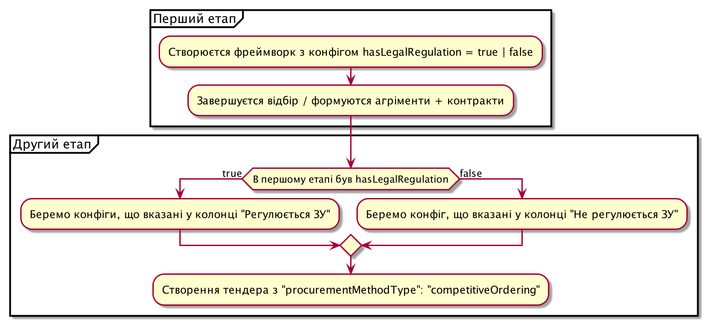

.. _config_has_legal_regulation:

hasLegalRegulation
===================

Параметр, що визначає наявність або відсутність законодавчого регулювання при проведенні закупівлі

Можливі значення параметру: true/false, де

* true - означає, наявність законодавчого регулювання при проведенні закупівлі
* false - означає, відсутність законодавчого регулювання при проведенні закупівлі

Відсутність законодавчого регулювання при проведенні закупівлі може бути тільки у двох процедурах: competitiveOrdering та belowThreshold.

Framework
---------
У відборі (1 етап) замовник самостійно зазначає чи наявне законодавчое регулювання при проведенні закупівлі через конфіг:

.. sourcecode:: http

    POST /api/2.5/frameworks HTTP/1.0

    Authorization: Bearer broker
    Content-Length: 1874
    Content-Type: application/json
    Host: lb-api-sandbox.prozorro.gov.ua

    {
      "data": {
        "frameworkType": "dynamicPurchasingSystem",
         ...
      },
      "config": {
        "hasLegalRegulation": false,
        ...
      }
    }

    HTTP/1.0 201 Created
    Content-Type: application/json
    Location: http://lb-api-sandbox.prozorro.gov.ua/api/2.5/frameworks/4178f66eebf04c4497d0fb223feeb0fe

    {
      "data": {
        "status": "draft",
        "frameworkType": "dynamicPurchasingSystem",
        ...
      },
      "config": {
        "hasLegalRegulation": false,
        ...
      }
    }

На другому етапі створення закупівлі буде вимагати різні параметри закупівлі.
(Хоче це все ще один procurementMethodType)

Вищевказані конфіги мають різні значення відповідно до конфігурації першого етапу.

Можливі значення вказані тут: https://confluence.prozorro.org/pages/viewpage.action?pageId=147095941

Конфігурації можуть бути винесені в окремі файли в стандартах.

Отут можна ознайомитись з запропонованими змінами до стандартів
https://github.com/ProzorroUKR/standards/pull/226/files

Тут видно, що для процедури competitiveOrdering.json (це конфіги, що вказані у колонці "Регулюється ЗУ") наприклад minBidsNumber може бути максимум 1:

.. sourcecode::

    "minBidsNumber": {
      "type": "integer",
      "minimum": 1,
      "maximum": 1,
      "default": 1
    },

то в окремому файлі для процедури нерегулюємої ЗУ `competitiveOrdering.nonRegulated.json` будуть інші значення:

.. sourcecode::

    "minBidsNumber": {
      "type": "integer",
      "minimum": 1,
      "maximum": 9,
      "default": 1
    },

Але це все ще один "procurementMethodType: competitiveOrdering".

belowThreshold
--------------

Конфігурації для процедури з наявним законодавчим регулюванням вказані в `data_model/schema/TenderConfig/belowThreshold.json`

З відсутнім законодавчим регулюванням: `data_model/schema/TenderConfig/belowThreshold.nonRegulated.json`

Валідації при створенні процедури
----------------------------------
При створенні закупівлі в якій вказаний `hasLegalRegulation: true`, але невірно вказані інші конфігурації, буде спрацьовувати валідації для значень, що вказані у колонці "Регулюється ЗУ":

.. sourcecode:: http

    POST /api/2.5/tenders HTTP/1.0

    Authorization: Bearer broker
    Content-Type: application/json
    Host: lb-api-sandbox.prozorro.gov.ua

    {
      "data": {
        ...
      },
      "config": {
        "hasLegalRegulation": true,
        "valueCurrencyEquality": false,
        ...
      }
    }

    HTTP/1.0 422 Forbidden
    Content-Type: application/json

    {
      "status": "error",
      "errors": [
        {
          "location": "body",
          "name": "valueCurrencyEquality",
          "description": "False is not one of [True]"
        }
      ]
    }

При створенні закупівлі в якій вказаний `hasLegalRegulation: false`, але невірно вказані інші конфігурації, буде спрацьовувати валідації для значень, що вказані у колонці "Не регулюється ЗУ":

.. sourcecode:: http

    POST /api/2.5/tenders HTTP/1.0

    Authorization: Bearer broker
    Content-Type: application/json
    Host: lb-api-sandbox.prozorro.gov.ua

    {
      "data": {
        ...
      },
      "config": {
        "hasLegalRegulation": false,
        "hasPrequalification": false,
        ...
      }
    }

    HTTP/1.0 422 Forbidden
    Content-Type: application/json

    {
      "status": "error",
      "errors": [
        {
          "location": "body",
          "name": "hasPrequalification",
          "description": "False is not one of [True]"
        }
      ]
    }

