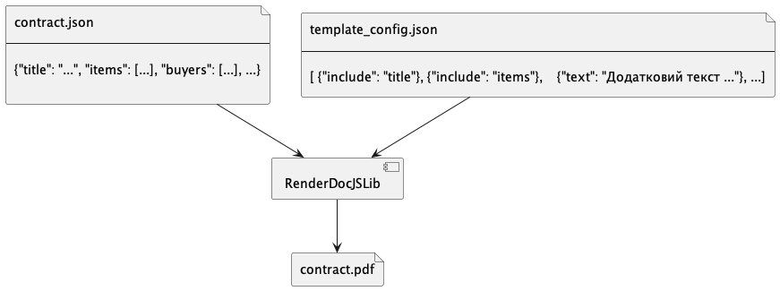
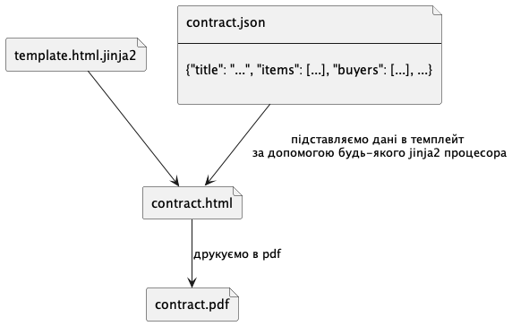
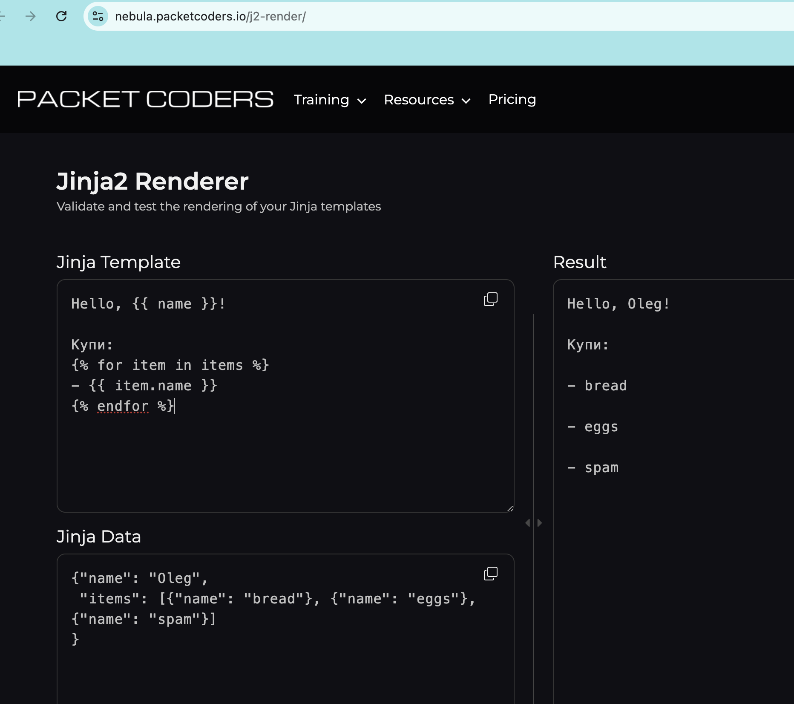

.. _features_rendering_documents_from_templates:

Підходи до рендеру документів з темплейтів та json
==================================================

Документ це pdf файл відповідного формату. Частина тексту і форматування є відносно сталими

Даний документ описує і порівнює два розглянуті варіанти.

Рендерінг за допомогою JS сервіса/бібліотеки
--------------------------------------------

Наразі використовуємо підхід,
де маємо репозиторій з кодом, який реаліщує бібліотеку для генерації pdf документів.

Маємо бібліотеку, яка js кодом описує усі правил генерації документів.
Вона приймає дані, які використовуються для наповнення.
Також може приймати конфіг, для конфігурації блоків документу або додавання додаткового тексту.

У випадку додавання нового темплейту **треба модифікувати вихідний код бібліотеки і робити реліз**.
Також треба робити тестування правильності генерації усіх темплейтів кожного разу.

З таким підходом дуже важко додати новий темплейт так, щоб точно не внести ніяких потенційних змін до всіх інших.

Рендерінг з html темлейтів
--------------------------

Інший поширений підхід -
це `розмічений спеціальним синтаксисом <https://jinja.palletsprojects.com/en/3.1.x/templates/>`_ html - файл.

Розмітка визначає правила підстановки даних в темплейт.
Темплейт визначає структуру документу і формат.

Таким чином сгенерувавши на початку темплейт документу, нам ми можемо герентувати його незмінність для всіх документів.

Сам сервіс, що підставляє дані в темплейт і рендерить pdf не буде потребувати змін для підтримки нових темплейтів.

У відкритому доступі є і  `аналогічні сервіси <https://nebula.packetcoders.io/j2-render/>`_ і бібліотеки.

Приклад html темплейту з розміткою

.. sourcecode:: html

    <html>
    <h3>Hello, {{ name }}!</h3>
    Please get us:
    <ul>
    <li>{{ item.name }}</li>
    </ul>
    </html>

.. sourcecode:: json

    {
       "name": "Oleg",
       "items": [{"name": "bread"}, {"name": "eggs"}, {"name": "spam"}]
    }

Порівняння підходів
-------------------

Зручність
~~~~~~~~~
Наявний підхід з JS біліотекою спрощує роботу, коли і документ і код генерації реалізують ті самі розробники.
Виходить нова версія - що підтримує новий документ.

Але якщо темплейтів буде дуже багато такий підхід майже унеможливлює роботу,
бо час релізного циклу бібліотеки буде рости пропорційно кіолькості темплейтів.

У випадку з тепелйтами в html не потрібно релізити код/сервіси щоб додати темплейт.

Підтримка
~~~~~~~~~

Для додавання темплейту в js бібілотеку необхідна кваліфікація JS розробника та знання як працює бібліотека.
Тобто будь-який JS розробник з ринку має ще витратити час на ознайомлення з кодом бібліотеки, перед тим як почати працювати з нею.

Для додавання html темплейту з розміткою jinja2 не потрібно знань мов програмування - лише знання html та jinja2 ,
що набагато простіше - відповідно легше/дешевше.
Також не потрібно витрачати час на ознайомлення з усіма попередньо створеними темплейтами, бо вони один на одного не впливають як у випадку з бібліотекою.

Тобто ситуація - треба новий темплейт і нікому його зробити.
JS бібліотека - шукаєм досвідченого JS розробника, який витратить 5днів на ознайомлення, 2 дні на новий темплейт, ще 2 дні на підготовку деплоя версії.
html бібліотека - шукаєм досвідченого html + jinaj2 верстальника, який за 2 дні верстає новий документ.

Надійність
~~~~~~~~~~
JS бібліотека це завжди black box. Немає дожних гарантій що темплейти однакові від версії до версії.
В свою чергу обидва рішення з часом можуть трохи відмінні вихідні файли навіть при незмінності наповнення.
Це стосується стилей, розміру / типів шрифтів.
Тобто один контракт згенерований рік тому і зараз може відрізнятись на якись відступ/піксель
і тому мати інший хеш вихідного файла.

Опис технічного рішення (HTML темлейти)
---------------------------------------

Згідно вимог,
адміністратор темплейтів ЦЗО може конфігурувати темлейт для типових контрактів.

Конфігурування складається з включення/виключення базових блоків
та додавання довільних абзаців.

Далі під час/після підписання контракт можна роздрукувати в pdf використавши даний темплейт і дані електроних полів з ЦБД.

Зберігатися темплейти будуть централізовано в обох підходах.
Але у випадку з html тепмлейтами, ми можемо мати git репозиторій базових блоків,
щоб посилатися на них при створенні тепелейта контракта.

наприклад маємо  git репозиторій з файлами базових блоків

.. sourcecode:: yaml

   -contracts/
    -2024/
     -base.html.jinja2
     -header.html.jinja2
     -items.html.jinja2
     -milestones.html.jinja2

Далі при створенні темлейту в апі передається "структура" темпелйту:

.. sourcecode:: http

    POST /api/templates/  HTTP/1.1

    Content-Type: application/json
    Host: lb-api.prozorro.gov.ua

    {
        "type": "contract",
        "base": "contracts/2024/base.html.jinja2",
        "content": [
          {
            "include": "contracts/2024/header.html.jinja2"
          },
          {
            "include": "contracts/2024/items.html.jinja2"
          },
          {
            "include": "contracts/2024/milestones.html.jinja2"
          },
          {
            "title": "Додаткові умови щодо якості товару",
            "text": "У випадку незадовільної якості замовник може застосувати фізичні санкції щодо постачальника."
          }
        ]
    }

    HTTP/1.1 200 OK
    Content-Type: application/json
    Location: http://lb-api.prozorro.gov.ua/api/templates/4178f66eebf04c4497d0fb223feeb0fe

    {
        "id": "4178f66eebf04c4497d0fb223feeb0fe",
        "type": "contract",
        "base": "contracts/base-2024.html.jinja2",
        "content": [
          {
            "include": "contracts/header-2024.html.jinja2",
          },
          {
            "include": "contracts/items-2024.html.jinja2",
          },
          {
            "include": "contracts/milestones-2024.html.jinja2",
          },
          {
            "title": "Додаткові умови щодо якості товару",
            "text": "У випадку незадовільної якості замовник може застосувати фізичні санкції щодо постачальника."
          }
        ],
        "documents":[
             {
                "id":"08682b48035643a39d924df55eb915e0",
                "hash":"md5:00000000000000000000000000000000",
                "title":"template.html.jinja2",
                "format":"text/plain",
                "url":"http://public-docs.prozorro.gov.ua/get/1ea9c5fa82c84b2a8206318bc86360df?Signature=x6tzZwzV4d5DGLeiqvD%2Bm0EdAUGgzUmYnoQ4AjImnxjQRU49JnE3aq50UHtPUVvIRfF5JSrLqmyF3tssHOT%2BCA%3D%3D&KeyID=a8968c46",
                "datePublished":"2023-10-10T01:00:00+03:00",
                "dateModified":"2023-10-10T01:00:00+03:00"
             }
        ]
    }

Створення конфігурації теплейта також створює сам файл теплейта,
який вже включає всю необхідну структуру на момент створення (з блоків репозиторія).

.. sourcecode:: html

    <html>
    

    <h1>Контракт #{{ contract_number }} {{ signed_date }}</h1>

    <h3>Предмети закупівлі</h3>
    <ul>
    <li>{{ item.name }}</li>
    </ul>

    <h3>Так звані майлстоуни</h3>
    <ul>
    <li>{{ milestone }}</li>
    </ul>

    <h3>Додаткові умови щодо якості товару</h3>
    

        У випадку незадовільної якості замовник може застосувати фізичні санкції щодо постачальника.
    

    </html>

В цей теплейт тільки треба підставити дані згідно правил jinja2 розмітки.

.. sourcecode:: http

    GET /api/contracts/1abf353aa1abf353aa1abf353aa1abf353aa/render/html  HTTP/1.1

    HTTP/1.1 200 OK
    Content-Type: text/html

    <html>
    

    <h1>Контракт #2024-12-12-0000001 2024-12-12 12:30:42</h1>

    <h3>Предмети закупівлі</h3>
    <ul>
        <li>Яйця</li>
        <li>Курка</li>
        <li>Набої 5.45</li>
    </ul>

    <h3>Так звані майлстоуни</h3>
    <ul>
        <li>Доставка вранці</li>
        <li>Оплата ввечері</li>
    </ul>

    <h3>Додаткові умови щодо якості товару</h3>
    

        У випадку незадовільної якості замовник може застосувати фізичні санкції щодо постачальника.
    

    </html>

Такий html файл можна відкрити користувачу на перегляд або роздрукутвати в pdf в браузері.
Або одразу скачати pdf:

.. sourcecode:: http

    GET /api/contracts/1abf353aa1abf353aa1abf353aa1abf353aa/render/pdf  HTTP/1.1

    HTTP/1.1 200 OK
    Content-Type: application/pdf
    Content-Disposition: attachment;filename=contract.pdf

    <<binary data goes here>>

Вищеописані ендпоінти для наповнення темплейту і генерації pdf
можуть бути відносно легко реалізовані в будь-якому іншому сервісі - на порталі, майданчиках etc.

