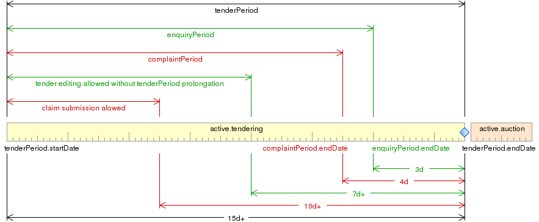

.. _tendering:

Tendering
=========

Open UA procedure has `active.tendering` status and can be represented with
the following diagram:

Constraints
-----------

 - `tenderPeriod` cannot be shorter than 15 days.

 - `enquiryPeriod` always ends 3 days before tenderPeriod ends.

 - If tender conditions are modified with less than 7 days left to
   `tenderPeriod.endDate`, it has to be extended to meet the constraint.

Claims and Complaits
~~~~~~~~~~~~~~~~~~~~

 - Claims can be submitted only if there are more than 10 days left
   in tenderPeriod.

 - Complaints can be submitted only if there are 4 or more days left in
   tenderPeriod.
