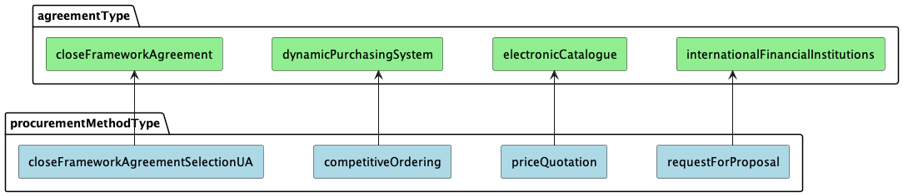

.. _has_pre_selection_agreement:

hasPreSelectionAgreement
========================

Field `hasPreSelectionAgreement` is a boolean field that indicates whether the tender has pre-selection procedure and has to be connected to agreement.

Possible values for `hasPreSelectionAgreement` field depends on `procurementMethodType` field:

.. csv-table::
   :file: csv/has-pre-selection-agreement-values.csv
   :header-rows: 1

hasPreSelectionAgreement is `true`
----------------------------------

If `hasPreSelectionAgreement` is `true`, then the tender will be connected to an agreement. It means that the tender will be created with `agreements` field with `id` field inside:

.. http:example:: http/has-pre-selection-agreement-true-tender-post.http
   :code:

System will validate if tender with specified `procurementMethodType` is allowed to be connected to an agreement with specific `agreementType`. Here is the diagram of allowed relations between `procurementMethodType` and `agreementType`:

On attempt to create a tender with `procurementMethodType` that is not allowed to be connected to an agreement with specific `agreementType`, the system will return an error:

.. http:example:: http/has-pre-selection-agreement-true-tender-post-invalid-type.http
   :code:

Standard rules
^^^^^^^^^^^^^^

For tender that is linked to an agreement, the following validations are applied on tender creation:

* if agreement has items, then tender items should be subset of agreement items

For tender that is linked to an agreement, the following validations are applied on tender activation:

* agreement should be active

dynamicPurchasingSystem -> competitiveOrdering
~~~~~~~~~~~~~~~~~~~~~~~~~~~~~~~~~~~~~~~~~~~~~~
For tender that is linked to an agreement, the following validations are applied on tender creation:

* agreement should not have items
* procuringEntity.identifier.id and procuringEntity.identifier.scheme should match in agreement and tender

For tender that is linked to an agreement, the following validations are applied on tender activation:

* agreement should have at least 3 active contracts

:ref:`competitiveordering` → :ref:`competitiveordering_short_tutorial`

electronicCatalogue -> priceQuotation
~~~~~~~~~~~~~~~~~~~~~~~~~~~~~~~~~~~~~
For tender that is linked to an agreement, the following validations are applied on tender activation:

* agreement should have at least 1 active contract
* each item profile should belong to the same agreement as the tender

:ref:`pricequotation` → :ref:`pricequotation_tutorial`

internationalFinancialInstitutions -> requestForProposal
~~~~~~~~~~~~~~~~~~~~~~~~~~~~~~~~~~~~~~~~~~~~~~~~~~~~~~~~
For tender that is linked to an agreement, the following validations are applied on tender activation:

* agreement should have at least 3 active contracts
* procuringEntity.identifier.id and procuringEntity.identifier.scheme should match in agreement and tender

:ref:`requestforproposal` → :ref:`requestforproposal_tutorial`

Specific rules
^^^^^^^^^^^^^^

Some procedures have specific distinctions in the rules of connection to an agreement.

closeFrameworkAgreementUA -> closeFrameworkAgreementSelectionUA
~~~~~~~~~~~~~~~~~~~~~~~~~~~~~~~~~~~~~~~~~~~~~~~~~~~~~~~~~~~~~~~
:ref:`cfaselectionua` → :ref:`cfaselection_tutorial`
