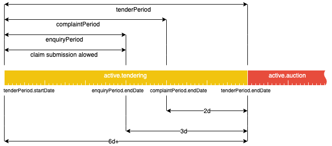

.. _defense_tendering:

Tendering
=========

The Defense open tender procedure has `active.tendering` status and can be represented with
the following diagram:

Constraints
-----------

 - `tenderPeriod` cannot be shorter than 6 working days.

 - `enquiryPeriod` always ends 3 working days before tenderPeriod ends.
 
 - If question is not answered `tenderPeriod` is extended for 2 working days.

Claims and Complaits
~~~~~~~~~~~~~~~~~~~~

 - Claims can be submitted only if there are more than 3 days left
   in tenderPeriod.

 - Complaints can be submitted only if there are 2 or more days left in
   tenderPeriod.
