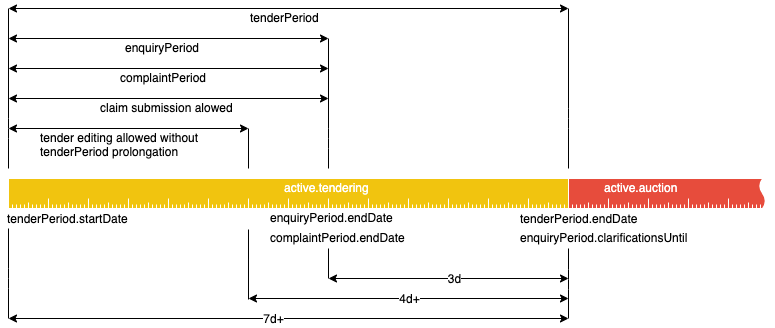

.. _open_tendering:

Tendering
=========

Open procedure has `active.tendering` status and can be represented with
the following diagram:

Constraints
-----------

 - `tenderPeriod` cannot be shorter than 7 days.

 - `enquiryPeriod` always ends 3 days before tenderPeriod ends.

 - If tender conditions are modified with less than 4 days left to
   `tenderPeriod.endDate`, this period should be extended so that
   from the moment of the change in the tender documentation until
   `tenderPeriod.endDate` has remained at least 4 days.

Claims and Complaits
~~~~~~~~~~~~~~~~~~~~

 - Claims can be submitted only if there are more than 3 days left
   in tenderPeriod.

 - Complaints can be submitted only if there are 3 or more days left in
   tenderPeriod.
