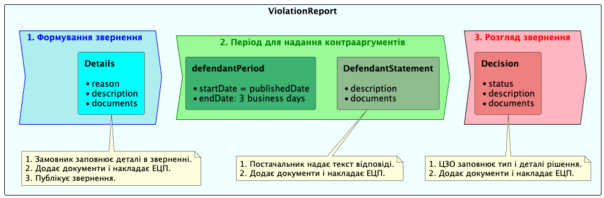

.. _violation_reports_overview:

Огляд
=====

API звітів про порушення є частиною Центральної бази даних OpenProcurement, що реалізує механізм подання скарг щодо порушень умов контракту (від замовників до постачальників).

Кожен етап або роль реалізує власний об’єкт API та REST API навколо нього.

Посилання на `swagger-ui <https://lb-api-sandbox-2.prozorro.gov.ua/api/0/doc>`_

